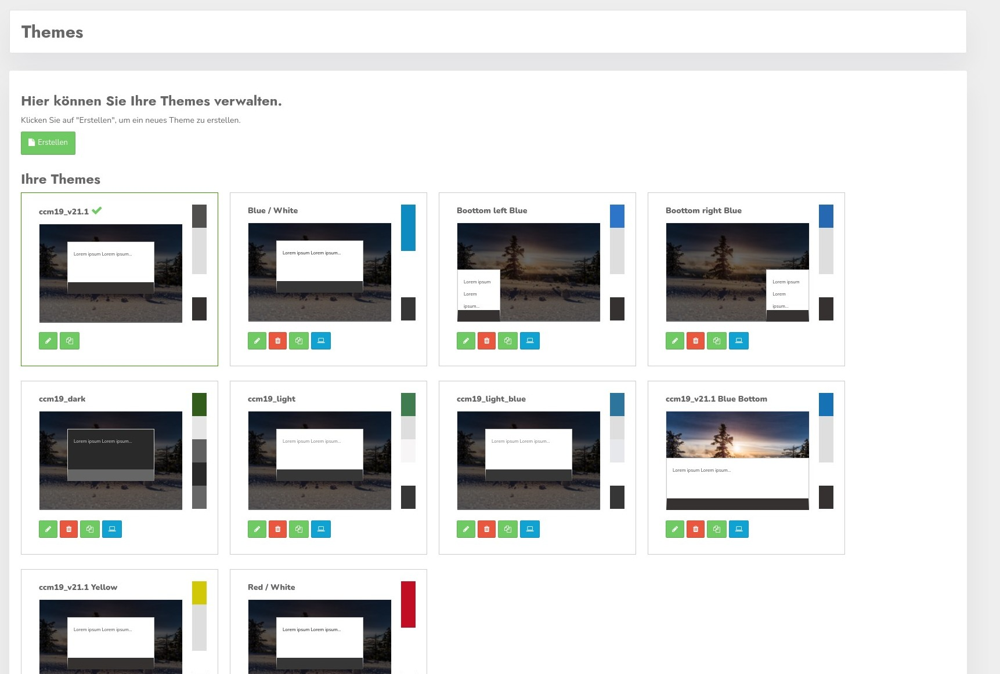
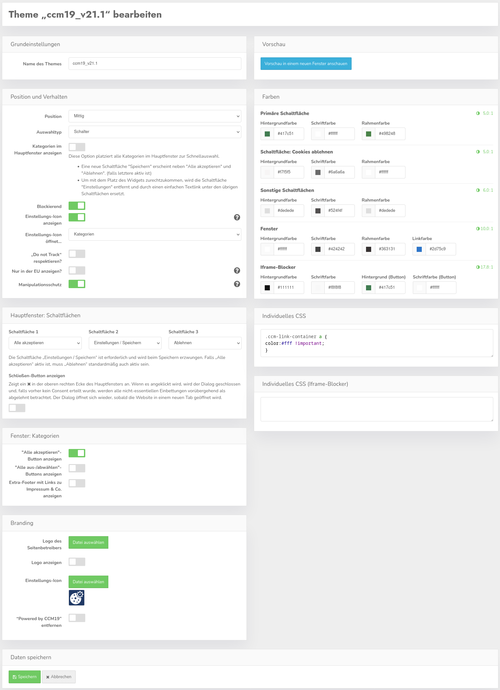
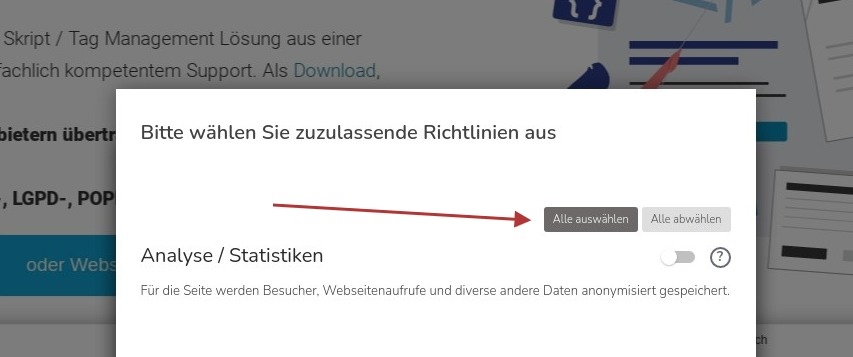
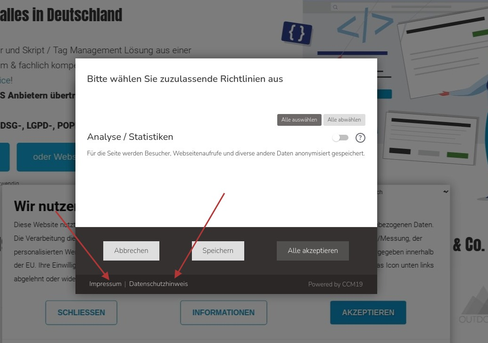
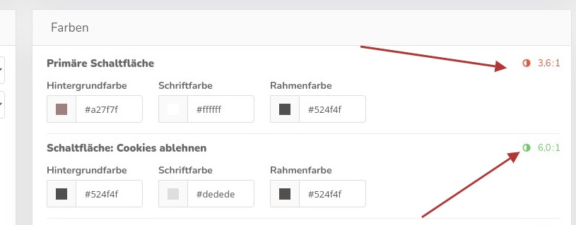

# Set up and use themes

<<<<<<< HEAD
CCM19 is completely themeable - that means you can customize the look of all elements of the frontend. You can try as many themes as you like.

If you click on the menu item "Themes" you will first see the overview of the existing themes.
=======
CCM19 ist komplett themefähig – d.h. Sie können alle Elemente des Frontends optisch anpassen. Sie können beliebig viele Themes ausprobieren.

Wenn Sie auf den Menüpunkt „Themes“ klicken sehen Sie zuerst die Übersicht der vorhandenen Themes.
>>>>>>> 1645c8cc3b2bc5e319fd50eee77ddfaad579bf1b




Clicking on the **green** pencil icon will take you to the edit screen, the **red** recycle bin will delete your theme ( after asking ), clicking on the double **green** folders will copy the existing theme 

Clicking on the **blue** icon sets the theme as default for the frontend.

## Create new theme

<<<<<<< HEAD
If you want to create a new theme you can either click on the button "Create" or you can copy an existing theme and adapt it.

Copying is the recommended procedure by CCM19 - also for individual adjustments to existing themes. This way you always have a fallback at hand.
=======
Wenn Sie ein neues Theme anlegen wollen können Sie zum einen auf den Button „Erstellen“ klicken oder Sie kopieren ein vorhandenes Theme und passen dieses an.

Das Kopieren ist das von CCM19 empfohlene Vorgehen – auch für individuelle Anpassungen an vorhandenen Themes. Auf diese Weise haben Sie immer ein Fallback zur Hand.
>>>>>>> 1645c8cc3b2bc5e319fd50eee77ddfaad579bf1b

## Customize Layout / Theme

<<<<<<< HEAD
In each theme you can define the theme with the help of various buttons and setting options. In addition, you have the possibility to customize every visual detail with the help of CSS instructions. The complete frontend mask can be influenced by CSS.



**Use `!important` for the individual CSS settings in case of doubt to override settings of your content management system.** In the interface you can set a lot of things. The settings you see here result in the following frontend.
=======
In jedem Theme können Sie mit Hilfe von diversen Buttons und Einstellmöglichkeiten das Theme definieren. Darüber hinaus haben Sie die Möglichkeit, mit Hilfe von CSS-Anweisungen jedes optische Detail anzupassen. Die komplette Frontendmaske ist per CSS beeinflussbar.


**Verwenden Sie bei den individuellen CSS-Einstellungen im Zweifel `!important` um Einstellungen Ihres Content-Management-Systems zu überschreiben.** In der Oberfläche können Sie einiges einstellen. Die Einstellungen die Sie hier sehen, resultieren in dem folgenden Frontend.
>>>>>>> 1645c8cc3b2bc5e319fd50eee77ddfaad579bf1b


## Preview

The Preview button allows you to preview the frontend widget. The click will not open your page but a page inside the CCM19 admin area. A reload is required after any change to the layout. The widget is fully functional - that means you can visually customize and test all elements of the widget.

In the background your current start page is always loaded as a screenshot so you can see the effect directly.

.jpg)

Preview with widget.


<<<<<<< HEAD
The buttons and background colors you set in the administration arrive directly in the frontend. You can also visually customize the links "Imprint" and "Privacy Policy".
=======
Die Buttons und Hintergrundfarben die Sie in der Administration einstellen, kommen direkt im Frontend an. Sie können ebenfalls die Links „Impressum“ und „Datenschutzerklärung“ optisch anpassen.
>>>>>>> 1645c8cc3b2bc5e319fd50eee77ddfaad579bf1b


## Buttons &amp; Settings

<<<<<<< HEAD
Furthermore, there are the following setting options:

### Position

Here you position the cookie banner on the website. You can choose the following positions:

* center
* top
* bottom
* bottom left
* bottom right

### Selection type

You can select whether the settings in the banner for categories and individual embeddings are displayed with checkmarks or buttons:

#### Checkmark

=======
Weiterhin gibt es die folgenden Einstellungsmöglichkeiten:

### Position

Hier positionieren Sie den Cookie-Banner auf der Website. Dabei können Sie folgende Positionen wählen:

* mittig
* oben
* unten
* unten links
* unten rechts

### Auswahltyp

Sie können auswählen, ob die Einstellungen im Banner für Kategorien und einzelnen Einbindungen mit Häkchen oder Schaltern dargestellt werden:

#### Häkchen

>>>>>>> 1645c8cc3b2bc5e319fd50eee77ddfaad579bf1b


#### switch


<<<<<<< HEAD
Of course, you can adjust the colors via the individual CSS settings.
=======
Die Farben können Sie natürlich über die individuellen CSS-Einstellungen anpassen.

### Kategorien im Hauptfenster anzeigen
>>>>>>> 1645c8cc3b2bc5e319fd50eee77ddfaad579bf1b

### Show categories in main window

<<<<<<< HEAD
This option places all categories in the main window for quick selection.

* A new "Save" button appears next to "Accept All" and "Reject". (if the latter is active)
* To deal with the widget space, the "Settings" button is removed and replaced with a simple text link below the remaining buttons.
=======
* Eine neue Schaltfläche "Speichern" erscheint neben "Alle akzeptieren" und "Ablehnen". (falls letztere aktiv ist)
* Um mit dem Platz des Widgets zurechtzukommen, wird die Schaltfläche "Einstellungen" entfernt und durch einen einfachen Textlink unter den übrigen Schaltflächen ersetzt.
>>>>>>> 1645c8cc3b2bc5e319fd50eee77ddfaad579bf1b

  

  

### Blocking

<<<<<<< HEAD
Blocking means that - as you can see on the screenshot - the page is darkened and blocked in the background. Only when a visitor has definitely decided whether to accept the [cookies](https://www.ccm19.de/glossar/13-Cookies.html#13) or not, he will be allowed on the page.
=======
Blockierend bedeutet, dass – wie auf dem Screenshot zu sehen ist – die Seite im Hintergrund abgedunkelt und blockiert wird. Erst wenn sich ein Besucher definitiv entschieden hat, ob er die [Cookies](https://www.ccm19.de/glossar/13-Cookies.html#13) akzeptiert oder nicht, wird er auf die Seite gelassen.
>>>>>>> 1645c8cc3b2bc5e319fd50eee77ddfaad579bf1b

### Show settings icon

<<<<<<< HEAD
If this checkmark is set, a settings icon will be displayed on the website via Javascript after the cookie banner has been confirmed. In this way, the revocation option required by the GDPR and the TTDSG can be provided easily and without further intervention on the page. The icon is placed in the bottom left corner by default.
=======
Wenn dieser Haken gesetzt ist, wird nach dem Bestätigen des Cookie-Banners ein Einstellungsicon per Javascript auf der Website angezeigt. Auf diese Weise kann die von der DSGVO und dem TTDSG geforderte Widerrufsmöglichkeit einfach und ohne weitere Eingriffe in die Seite bereitgestellt werden. Das Icon wird standardmäßig in der Ecke links unten platziert.
>>>>>>> 1645c8cc3b2bc5e319fd50eee77ddfaad579bf1b


<<<<<<< HEAD
### Settings icon opens..

Here you set which window a click on the settings icon should open; the 1st or the 2nd layer of the widget, i.e. the general home view or the detail view with the corresponding selection.

### "Do not Track" respect

If this setting is enabled, then the "Do not Track" (DNT) setting in the browser is automatically respected and implemented - i.e. no cookie banner is displayed, but only technically necessary elements are loaded directly if the visitor has enabled DNT in his browser.

However, it should be noted that this setting is usually disabled in most browsers and is already considered obsolete by some browsers.
=======
### Einstellungsicon öffnet…

Hier stellen Sie ein, welches Fenster ein Klick auf das Einstellungsicon öffnen soll; den 1. oder den 2. Layer des Widgets, also die generelle Startansicht oder die Detailansicht mit der entsprechenden Auswahl.

### „Do not Track“ respektieren

Wenn diese Einstellung aktiviert ist, dann wird automatisch die Einstellung „Do not Track“ (DNT) im Browser respektiert und umgesetzt – d.h. es wird kein Cookie-Banner angezeigt, sondern direkt nur technisch notwendige Elemente geladen, wenn der Besucher DNT in seinem Browser aktiviert hat.

Allerdings gilt zu beachten, dass diese Einstellung in den meisten Browser normalerweise deaktiviert ist und von einigen Browsern bereits als veraltet betrachtet wird.
>>>>>>> 1645c8cc3b2bc5e319fd50eee77ddfaad579bf1b

### Show only in the EU

<<<<<<< HEAD
With this setting you can specify that the cookie notice is only displayed to visitors from the EU. The resolution is based on the visitor's IP used and therefore cannot be 100% accurate. For visitors from other countries, all cookies will be enabled unless the visitor signals "Do Not Track" and "Respect Do Not Track" has been enabled.
=======
Mit dieser Einstellung können Sie festlegen dass der Cookie-Hinweis nur Besuchern aus der EU angezeigt wird. Die Auflösung erfolgt anhand der verwendeten IP des Besuchers und kann daher nicht 100%ig genau sein. Bei Besuchern aus anderen Ländern werden alle Cookies aktiviert, außer wenn der Besucher „Do Not Track“ signalisiert und „Do Not Track respektieren“ aktiviert wurde.
>>>>>>> 1645c8cc3b2bc5e319fd50eee77ddfaad579bf1b

This product contains GeoLite2 data from MaxMind, available at [https://www.maxmind.com](https://5f3c395.ccm19.de/app/public/themes/&amp;guot;https://www.maxmind.com&amp;guot;).

### Tamper protection

<<<<<<< HEAD
This setting prevents simulated clicks on the Accept buttons in order to protect the user's cookie selection and thus strengthen your legal position when submitting the Consent.
=======
Diese Einstellung verhindert simulierte Klicks auf die Akzeptieren-Buttons, um die Cookie-Auswahl des Nutzers zu schützen und damit Ihre rechtliche Position bei der Abgabe des Consents zu stärken.

Leider können einige Scripte wie "fastclick", die in die Verarbeitung von Fingerberührungen und Mausklicks eingreifen, diesen Schutz auslösen. Falls Sie ein solches Script verwenden, prüfen Sie bitte, ob Sie es wirklich benötigen und ob der Cookie-Dialog trotzdem in den üblichen Mobil-Browsern benutzbar ist. Ansonsten kann es notwendig sein den Manipulationsschutz abzuschalten.
>>>>>>> 1645c8cc3b2bc5e319fd50eee77ddfaad579bf1b

Unfortunately, some scripts like "fastclick" that interfere with finger touch and mouse click processing can trigger this protection. If you use such a script, please check if you really need it and if the cookie dialog is still usable in the usual mobile browsers. Otherwise it may be necessary to disable the tamper protection.

**Deaktivieren Sie diese Funktion nicht, wenn Sie sich nicht sicher sind, dass es unbedingt notwendig ist. Dies könnte Ihre rechtliche Position beim Beweisen, dass Consent erteilt wurde, schwächen.**

**Do not disable this feature unless you are sure it is absolutely necessary. This could weaken your legal position when proving that consent was given

<<<<<<< HEAD
## Main window buttons

Here you can specify the order and selection of the buttons in the main window of the cookie banner.

Additionally, with the "Show close button" setting, a ✖ can be displayed in the upper right corner of the banner.
Clicking on it temporarily closes the cookie dialog until the browser tab is closed and only technically necessary cookies are loaded.

Notice:

According to TTDSG and DSGVO, there needs to be an equivalent option in a Consent widget to reject or cancel the cookies as to accept the cookies.
Therefore, it is automatically ensured that the Settings button is always active and the Reject button is active as soon as the Accept All button is activated.

In the exceptional case that you can comply with the relevant regulations for your target markets without a reject button, the latter security feature can be disabled in the "Developer Settings".

## Categories main window

Here you can define the functionality in the categories window (2nd level) of the cookie banner.

### Show "Accept All" button in the Categories window

With this setting, an additional "Accept All" button will be displayed in the Categories window.


### Show all off/unselect buttons



If you check the box here, a corresponding selection will be offered, allowing a visitor to enable/disable all embeddings at once.

### Extra footer with links to imprint &amp; co.



If this checkmark is set, a footer with links to imprint and privacy &amp; co. is also shown in the 2nd level.
=======
Hier können Sie die Reihenfolge und Auswahl der Schaltflächen im Hauptfenster des Cookie-Banners festlegen.

Zusätzlich kann mit der Einstellung „Schließen-Button anzeigen“ ein ✖ in der oberen rechten Ecke des Banners angezeigt werden.
Ein Klick darauf schließt den Cookie-Dialog vorübergehend bis der Browser-Tab geschlossen wird und es werden nur technisch notwendige Cookies geladen.

Hinweis:

Nach TTDSG und DSGVO braucht es in einem Consent-Widget eine gleichwertige Möglichkeit die Cookies abzulehnen oder abzubrechen wie die Cookies anzunehmen.
Daher wird automatisch sichergestellt, dass der Button „Einstellungen“ immer aktiv ist, und der Ablehnen-Button aktiv ist, sobald der Alles-Annehmen-Button aktiviert wurde.

Für den Ausnahmefall, dass Sie die relevanten Vorschriften für ihre Zielmärkte auch ohne einen Ablehnen-Button erfüllen können, lässt sich letztere Sicherheitsfunktion in den „Developer-Einstellungen“ abschalten.

## Hauptfenster Kategorien

Hier können Sie die Funktionalität im Kategorien-Fenster (2. Ebene) des Cookie-Banners festlegen.

### "Alle akzeptieren"-Button anzeigen im Fenster Kategorien

Mit dieser Einstellung wird im Kategorien-Fenster ein zusätzlicher "Alles Akzeptieren"-Button angezeigt.


### Alle aus/abwählen-Buttons anzeigen


Wenn Sie hier das Häkchen setzen, wird eine entsprechende Auswahl angeboten, mit der ein Besucher alle Einbindungen auf einmal aktivieren/deaktivieren kann.

### Extra-Footer mit Links zu Impressum & Co.


Ist dieser Haken gesetzt, wird auch in der 2. Ebene eine Fußzeile mit Links zu Impressum und Datenschutz & Co. eingeblendet.
>>>>>>> 1645c8cc3b2bc5e319fd50eee77ddfaad579bf1b

Not active by default.

### Logo of the page operator

<<<<<<< HEAD
Here you can upload a logo for the cookie banner. This will be displayed in the cookie banner above the text. By default, no logo is displayed.
=======
Hier können Sie ein Logo für den Cookie-Banner hochladen. Dieses wird im Cookie-Banner oberhalb des Textes angezeigt wird. Standardmäßig wird kein Logo angezeigt.

Wenn Sie schon ein Logo hochgeladen haben und wieder löschen möchten, klicken Sie auf den Pfeil rechts neben „Datei auswählen“, dann auf „Bild zurücksetzen“ und schließlich auf Speichern.
>>>>>>> 1645c8cc3b2bc5e319fd50eee77ddfaad579bf1b

If you have already uploaded a logo and want to delete it again, click on the arrow to the right of "Select file", then on "Reset image" and finally on Save.

<<<<<<< HEAD
### Show logo

This allows you to set whether the logo should be displayed in the cookie banner.

### Remove Powered By CCM19
=======
Damit können Sie einstellen, ob das Logo im Cookie-Banner angezeigt werden soll.

### Powered By CCM19 entfernen

Im Cookie-Banner wird standardmäßig unten rechts mit dem Text „Powered by CCM19“ auf die Website von CCM19 verlinkt.
Dieser Link kann durch setzen dieses Hakens entfernt werden.
Allerdings ist dies nur möglich wenn vorher eine Whitelabel-Lizenz für diese Installation erworben wurde.
>>>>>>> 1645c8cc3b2bc5e319fd50eee77ddfaad579bf1b

By default, the cookie banner links to the CCM19 website in the bottom right corner with the text "Powered by CCM19".
This link can be removed by checking this box.
However, this is only possible if a whitelabel license for this installation has been purchased before.

<<<<<<< HEAD
### Colors

Here you can set the colors for the various buttons and backgrounds in the frontend - please note that frames are also partially dependent on this, if you set a white frame on a white background with white text, you will of course no longer see anything. It is best to check each change once in the frontend by calling the overlay again!

Please note that the contrast for the colors should also meet certain minimum requirements to achieve a certain level of accessibility.
To help with this, the contrast ratio between text and background is displayed to the right of the color settings.



That the contrast is high enough is shown by color. For the buttons, for example, a measure of 5:1 should be reached at least. If the number is red, the contrast is too low.

Please note that the contrast indicators must be green if you use TCF / IAB.

### CSS

Here you can enter completely individual CSS - for the individual elements please have a look at the page inspector of your browser. In case of doubt you have to overwrite settings by `!important` - **Example:**

``css
.ccm-root button {
    border:1px solid #c2bcbc 
}
.ccm-control-panel--purpose &gt; input[type="checkbox"] + label {
	color:#ccc;
} 
.ccm-modal--footer {
    background-color:#26282f 
} 
 
```

### Custom CSS iframe blocker

Here you can assign individual CSS instructions for the iframe blocker, e.g. for special background images.
To make it easier to set targeted CSS, the blocked domain is set as a CSS class on the HTML element.

Example:
- Blocked is ``https://www.google.com/maps/...``
- In the iframe, the HTML element gets the class as follows: ``domain--www-google-com``
- Possible CSS:
=======
Hier stellen Sie für die verschiedenen Buttons und Hintergründe im Frontend die Farben ein – Achten Sie hier darauf dass auch Rahmen teilweise davon abhängen, wenn Sie einen weißen Rahmen auf weißem Hintergrund setzen mit weißer Schrift sehen Sie natürlich nichts mehr. Am besten kontrollieren Sie jede Änderung einmal im Frontend indem Sie das Overlay neu aufrufen!

Bitte beachten Sie dass der Kontrast für die Farben auch bestimmten Mindestanforderungen genügen sollte, um einen gewisses Maß an Barrierefreiheit zu erreichen.
Um dabei zu helfen, wird rechts neben den Farbeinstellungen das Kontrastverhältnis zwischen Text und Hintergrund angezeigt.


Dass der Kontrast hoch genug ist, wird farblich dargestellt. Für die Schaltflächen sollte beispielsweise ein Maß von 5:1 mindestens erreicht sein. Ist die Zahl rot, ist der Kontrast zu niedrig.

Beachten Sie bitte dass die Kontrastanzeiger zwingend grün sein müssen wenn Sie TCF / IAB nutzen.

### CSS

Hier können Sie komplett individuelles CSS eintragen – für die einzelnen Elemente schauen Sie bitte in den Seiteninspektor Ihres Browsers. Im Zweifel müssen Sie Einstellungen per `!important` überschreiben – **Beispiel:**

```css
.ccm-root button {
    border:1px solid #c2bcbc; 
}
.ccm-control-panel--purpose > input[type="checkbox"] + label {
	color:#ccc;
} 
.ccm-modal--footer {
    background-color:#26282f; 
}       
 
```

### Individuelles CSS Iframe-Blocker

Hier können Sie für den Iframe-Blocker individuelle CSS-Anweisungen vergeben, z.B. für spezielle Hintergrundbilder.
Um das Setzen von gezieltem CSS zu vereinfachen, wird die blockierte Domain als CSS-Klasse auf dem HTML-Element gesetzt.

Beispiel:
- Blockiert wird ``https://www.google.com/maps/…``
- Im Iframe erhält das HTML-Element die Klasse wie folgt: ``domain--www-google-com``
- Mögliches CSS:
>>>>>>> 1645c8cc3b2bc5e319fd50eee77ddfaad579bf1b

~~~``css
```
html.domain--www-google-com body {
    background-image: url('google-maps-placeholder.jpg');
}
html.domain--www-facebook-com body {
    background-image: url('facebook-placeholder.jpg');
}
~~~
