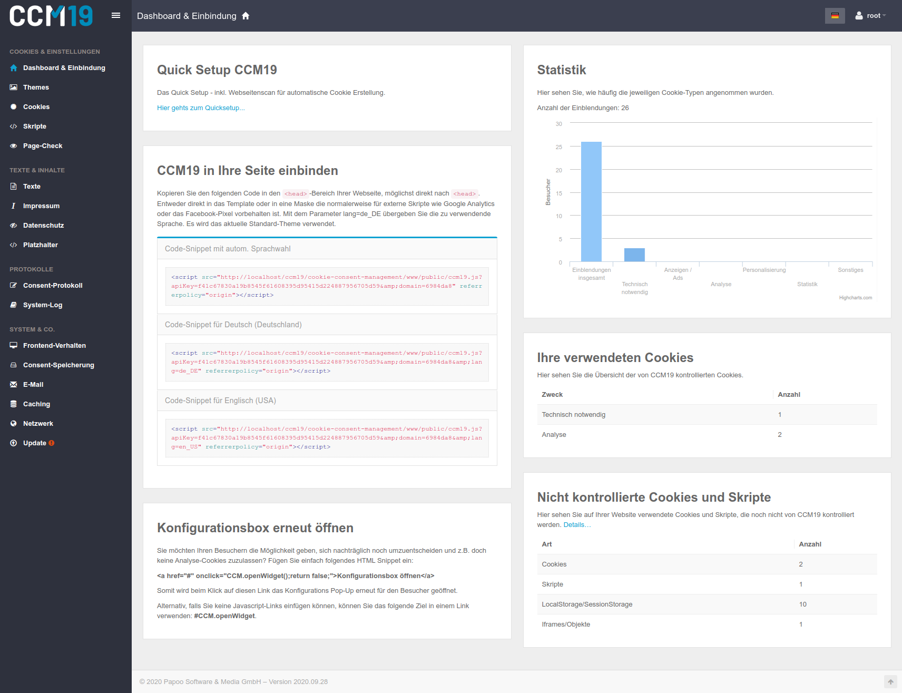
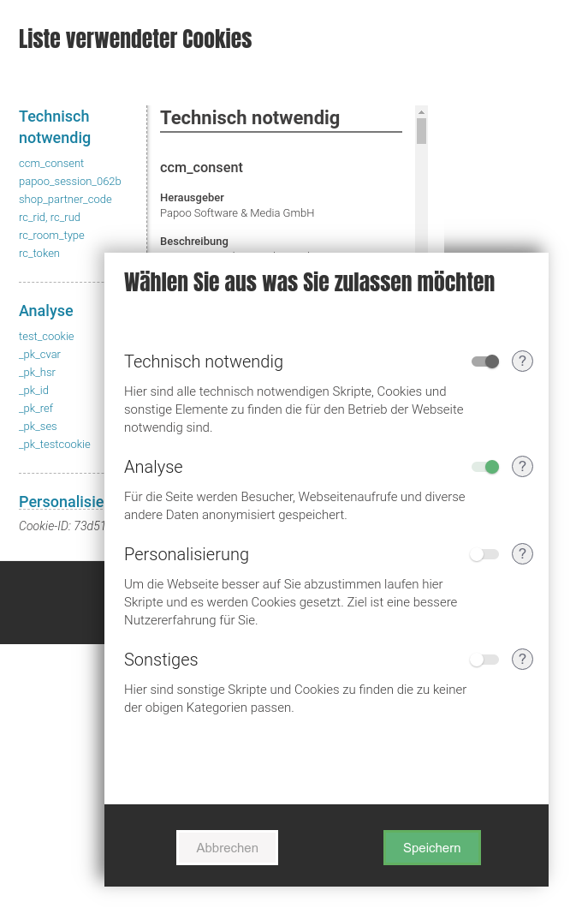

# Dokumentation CCM19 - Cookie Consent Manager

CCM19 ist ein Cookie Consent Manager Tool mit dem Sie für Ihre Webseite alle Cookoies, externe Skripte und deren Nutzung verwalten und den Besuchern Ihrer Webseite zur Auswahl stellen können. Hier sehen Sie einen Screenshot aus der Administration.

Ziel für den Betreiber ist es möglichst viele Benutzer rechtskonform dazu zu motivieren die Cookies und Skripte der Seite zu akzeptieren. Cookie Management ist ein heikles Thema bei dem man einiges falsch aber auch vieles richtig machen kann. CCM19 ist das richtige Tool um möglichst alles richtig machen zu können.

CCM19 bringt ein komplettes Cookie Handling mit, Sie können jede Cookie Gruppe von den Besuchern abnicken lassen und alle Details komplett selber verwalten.

## Frontend

## Backend

