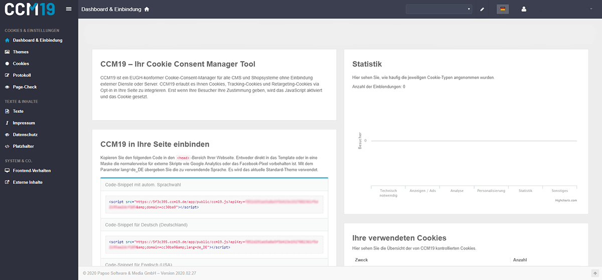
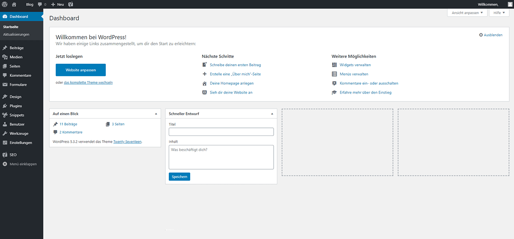
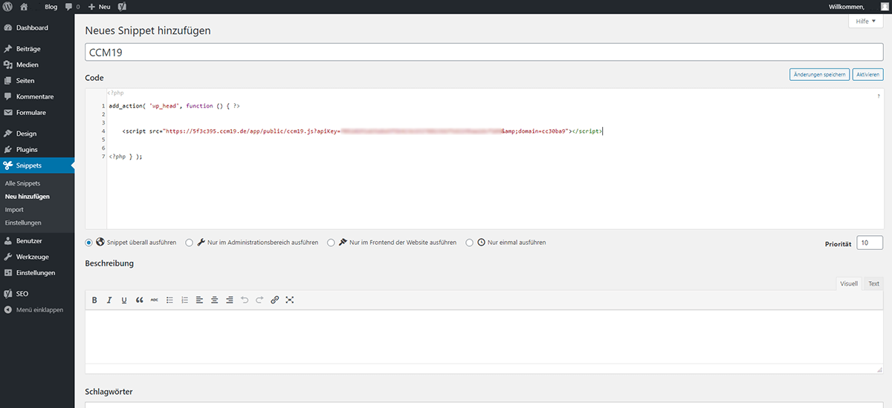
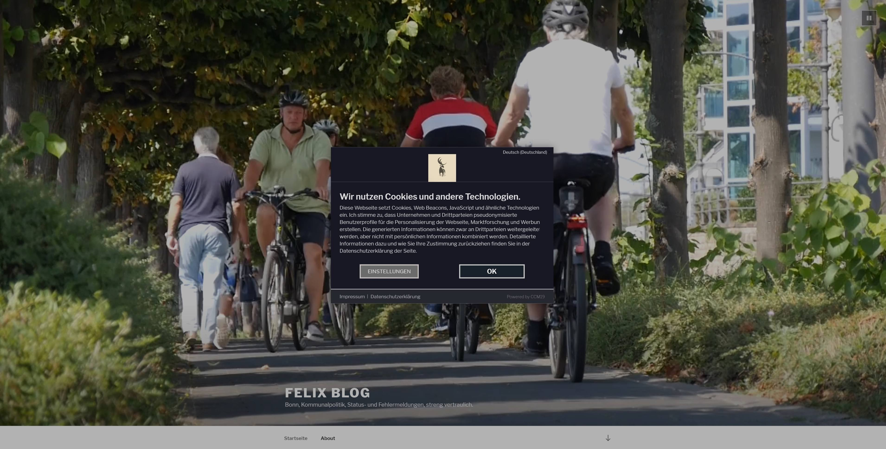

# Wordpress

Um den Cookie [Consent](https://www.ccm19.de/integration/glossar/10-Consent.html#10) Manager von Papoomedia für Ihren WordPress-Blog oder Ihre WordPress-Webseite zu installieren, führen Sie einfach die folgenden Schritte aus:

\1. Melden Sie sich bei Ihrem CCM19 Tool an und suchen Sie auf dem Dashboard den Punkt "CCM19 in Ihre Seite einbinden". Dort ist das"Code-Snippets" für Ihre CCM19 Installation hinterlegt. Für unsere Test-Installation verwenden wir den "Code-Snippet mit autom. Sprachwahl".

 

\2. Für die Integration des Cookie Managers in eine WordPress-Webseite, muss Ihre Webseite in der Lage sein, Codes oder Skripte in den Head-Bereich aller Seiten und Unterseiten zu integrieren. Dafür stehen bei WordPress kostenlose PlugIns bereit. Loggen Sie sich in Ihre Wordpress-Seite ein, wie Sie es gewohnt sind.

 

\3. Wählen Sie zur Installation des Plugins "Code Snippets" auf der linken Seite Ihrer WordPress-Verwaltung den Menüpunkt "Plugins" und darunter den Punkt "installieren" aus. Auf der rechten Seite (Oben) geben Sie nun die Stichwörter "Code Snippets" ein bzw. suchen danach. "Code Snippets" ist ein kostenloses Plugin für Wordpress, welches die Einbindung beliebiger Codes in Ihre WordPress-Webseite ermöglicht. Installieren/Aktivieren Sie das Code-Snippet-Plugin für Ihre Webseite.

 

\4. Im Menü auf der linken Seite sollte nun ein neuer Menüpunkt ("Snippets") auftauchen. Klicken Sie auf diesen Menüpunkt und anschließend auf der rechten Seite auf den Link "**Beispiel für JavaScript Snippet**".

 

\5. **Kopieren** Sie aus dem Fenster "Code" den gesamten Code, der dort angezeigt wird.

 

\6. Klicken Sie nun im Menü auf der linken Seite (unter "Snippets") auf die Schaltfläche "Neu Hinzufügen" und tragen Sie dort im Fenster "Code" den gerade kopierten Code ein. Als Namen haben wir hier "CCM19" in die oberste Eingabezeile eingepflegt.

**Sie können den Code auch von hier kopieren:**
add_action( 'wp_head', function () { ?>
/* Füge hier das CCM19 Snippet ein. */
<?php } );

 

\7. Nun fügen Sie den Snippet-Code, der vom Cookie Consent Manager bereitgestellt wird, dort ein, wo in dem neuen Snippet der Text "/* Schreibe Deinen JavaScript Code hier */" steht. Vergessen Sie nicht, auf "Speichere Änderungen und Aktiviere" zu klicken.

 

\8. Et voila, nun sollte der Cookie Consent Manager auf Ihrem WordPress-Blog installiert sein und Cookiemeldungen einblenden.

 