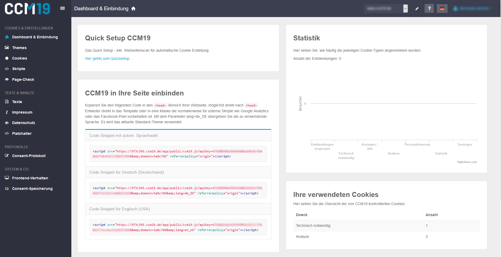
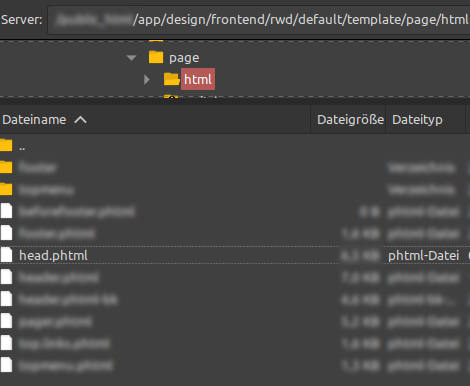
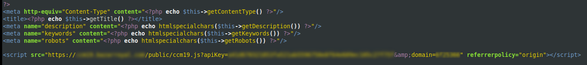

# Magento

To install our Cookie Consent Manager for your Magento site, simply follow the steps below:

## Select Dashboard in CCM19

   After successful installation of CCM19 on your server or setup, you will get a javascript code.

   

## Magento Template

Unfortunately, Magento doesn't have a good way to include CCM19's script far enough up the page header, which means you'll have to edit the template to do this.

In your Magento installation, edit the file ``/app/design/frontend/rwd/default/template/page/html/head.phtml` and add the Javascript from CCM19. (If the file is not there, use another theme than the default "rwd" theme)

Now just save this change and clear the cache of your Magento page.

This completes the setup and CCM19 should now be active in your site.