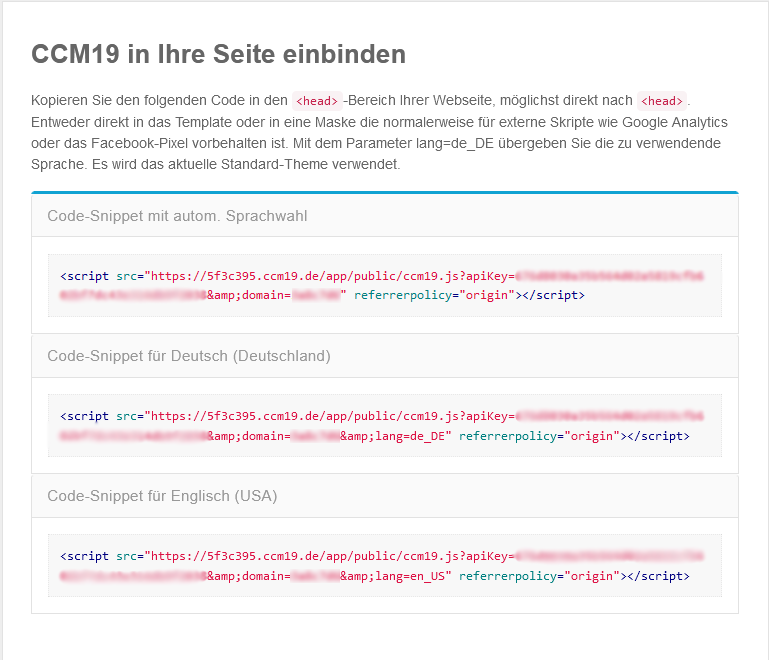

# Magento

Um unseren Cookie Consent Manager für Ihre Magento-Seite zu installieren, führen Sie einfach die folgenden Schritte aus:

## Dashboard in CCM19 anwählen

   Nach der erfolgreichen Installation von CCM19 auf Ihrem Server bzw. der Einrichtung bekommen Sie einen Javascript-Code.

   

## Magento Template

Leider gibt es bei Magento keine gute Möglichkeit, dass Script von CCM19 weit genug oben im Kopf der Seite einzubauen, wodurch Sie das Template hierfür bearbeiten müssen.

Bearbeiten Sie in Ihrer Magento Installation, die Datei ``/app/design/frontend/rwd/default/template/page/html/head.phtml` und tragen Sie das Javascript von CCM19 ein.

Nun speichern Sie diese Änderung einfach und leeren den Cache Ihrer Magento Seite.

Damit ist die Einrichtung abgeschlossen und CCM19 sollte nun in Ihrem Shop aktiv sein.