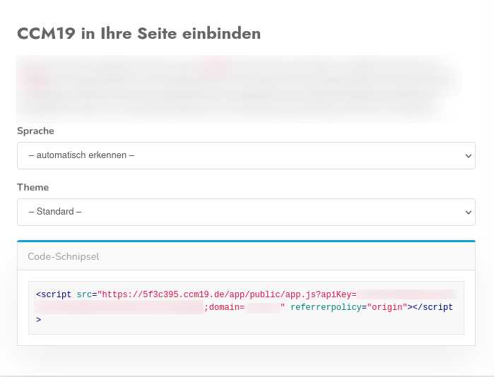

# Shopify

Shopify ist ein immer beliebter werdender Baukasten um seinen Webshop schnell und einfach einzurichten. Genauso einfach wie die Erstellung des Shops ist auch die Implementation unseres Javascripts in Shopify.

## Dashboard in CCM19 anwählen

   Nach der erfolgreichen Installation von CCM19 auf Ihrem Server bzw. der Einrichtung bekommen Sie einen Javascript-Code. Kopieren Sie sich diesen in Ihren Zwischenspeicher.

## Shopify Backend 

Loggen Sie sich in das Backend Ihres Shops ein. Navigieren Sie in die Themeeinstellungen (1.) und bearbeiten Sie Ihr aktuelles Theme (2.).

Öffnen Sie anschließend die Einstellungen mithilfe der drei Punkte im oberen linken bereich (1.) und klicken Sie auf "Edit code".

Nun sehen wir die Dateien aus denen Ihr Shop besteht. Unter Layout befindet sich die Datei "theme.liquid", welche Sie nun editieren müssen (1. & 2.). Fügen Sie das Javascript von CCM29, welches sich noch im Zwischenspeicher befindet nach dem Element <head> ein, so wie hier im Bild zu sehen (3.).

## Fertig

Testen Sie im Frontend Ihrer Seite ob nun das Widget erscheint. Denken Sie daran dieses auch in den EInstellungen von CCM19 vorher zu aktivieren (Menüpunkt: Frontend-Verhalten).

