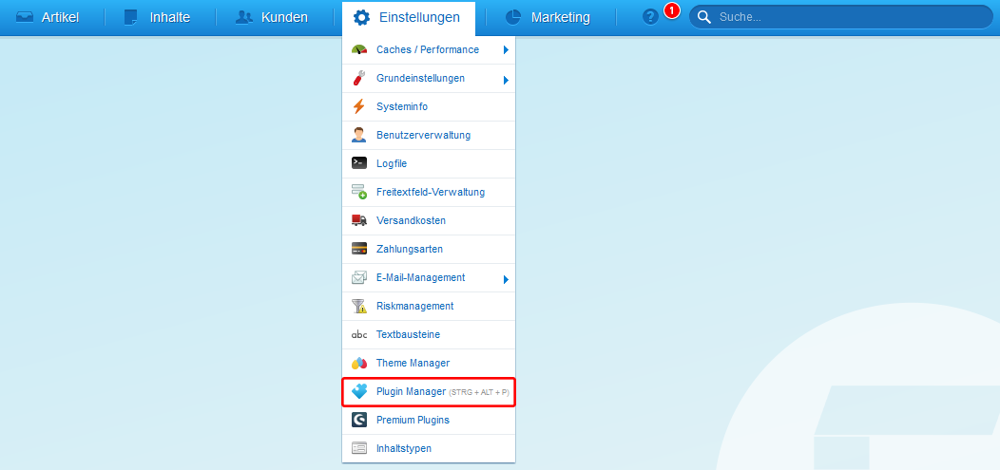
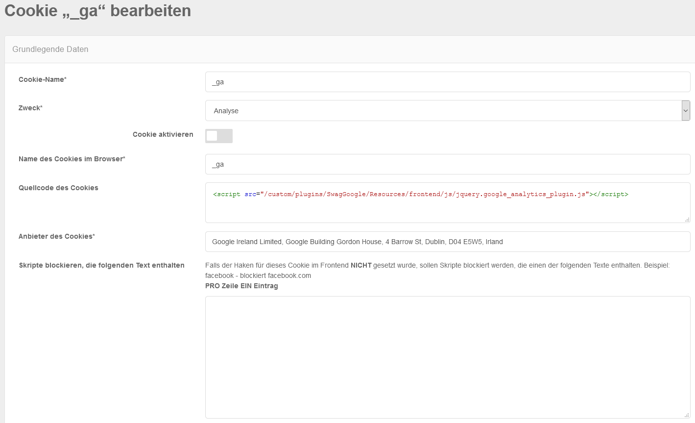

# Shopware

After the successful installation of CCM19 on your server or setup, you will get a javascript code in the dashboard of CCM19 (seen here below in the screenshot).

After that, switch to your Shopware installation. There you go in the top menu to the item **Settings** and then to **Plugin Manager**. There you search for the plugin **CCM19-Interation** and install it in your Shopware instance.

Once the installation is complete you can paste the CCM19 code snippet into the field provided. Please note that the item "Block Google Analytics" should be switched active.

Then go back to CCM19. Call the cookie **_ga** and insert the following line in the source code of the [cookie](https://www.ccm19.de/integration/glossar/13-Cookies.html#13):

``

This completes the setup and CCM19 should now be active in your store.