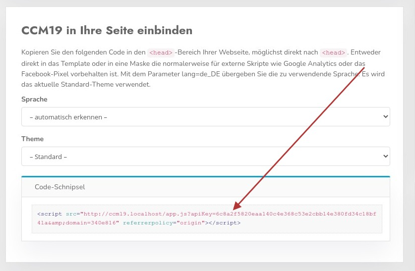

# Base / Standard Integration

The question that naturally arises: how do I link my website / online store with CCM19 or how do I get the banner on my page?

The solution is actually very simple, you just have to integrate a small piece of HTML code that the CCM19 system delivers ready to use into your page.

You can find the snippet in the dashboard of your CCM19 installation - always suitable for the respective domain.

Most CMS / Shop systems have a ready to use interface for this kind of integration, so you can do it easily. A number of systems are listed in the menu on the left.

## Dashboard in CCM19 

in your dashboard you will find the following area.



If you want to use a special language, you can select it with the Language select field 

In addition, you can specify a theme that should be called, different from the default theme.

The finished snippet is marked with the red arrow.

## Embed code

The embed code can look like this, for example.

`` html
<script src="http://CCM19ServerUrl/app.js?apiKey=1234&amp;domain=1234&amp;lang=de_DE" 
referrerpolicy="origin">
    </script>
```


## Example integration

Copy this code and paste it on your page as high as possible in the header of the page, preferably right after the first <head>element

``` html
<html>
 <head>
  <script src="http://CCM19ServerUrl/app.js?apiKey=1234&domain=1234" 
          referrerpolicy="origin"></script>
 </head>
 <body>
 </body>
<html>   
```


After this pattern, all other integrations in all possible CMS / store systems run. Depending on the system used, it is a little more complex or easier to accommodate this snippet.

Most CMS / Shop systems have a ready interface for these things, so that you can easily integrate it
</html></html></head> 