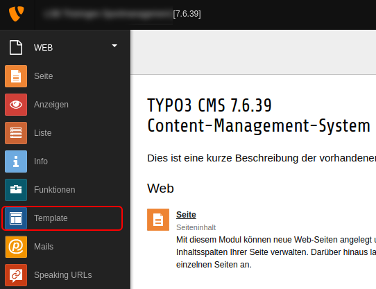
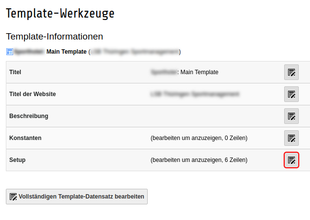

# TYPO3

To install our Cookie Consent Manager for your TYPO3 site, simply follow the steps below:

## Select Dashboard in CCM19

After successful installation of CCM19 on your server or setup you will get a javascript code.


## TYPO3 Backend

Afterwards, log in to the TYPO3 backend as usual. Once there, open the menu item "Template".



In the menu item "Template", open the template, which is currently active for your website.


Once in this template, edit the setup.



In the setup insert now the following code (Attention: This code may not be correct with different TYPO3 version):

``html
page.headerData.1 = TEXT
page.headerData.1.value (
   <script src="https://www.xy.de/ccm19/public/ccm19.js?apiKey=123a&amp;domain=123&amp;lang=de_DE" referrerpolicy="origin"></script>
)
```

Then just save this change and empty the cache of your TYPO3 page.


This completes the setup and CCM19 should now be active in your site.