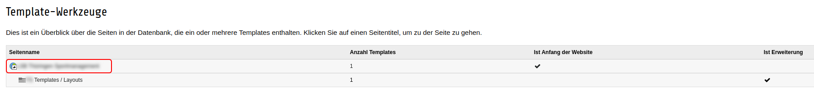
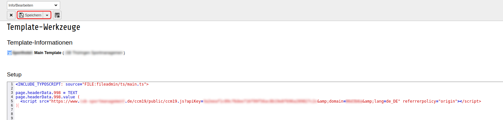

# TYPO3

Um unseren Cookie Consent Manager für Ihre TYPO3-Seite zu installieren, führen Sie einfach die folgenden Schritte aus:

## Dashboard in CCM19 anwählen

Nach der erfolgreichen Installation von CCM19 auf Ihrem Server bzw. der Einrichtung bekommen Sie einen Javascript-Code.


## TYPO3 Backend

Anschließend, melden Sie sich normal im TYPO3 Backend an. Dort angekommen, öffnen Sie den Menüpunkt "Template".


Im Menüpunkt "Template", öffnen Sie das Template, was derzeit für Ihrer Webseite aktiv ist.



In diesem Template angekommen, bearbeiten Sie das Setup.


In dem Setup fügen Sie nun folgenden Code ein (Achtung: Dieser Code kann mit verschiedenen TYPO3 Version nicht korrekt sein):

```html
page.headerData.1 = TEXT
page.headerData.1.value (
    <script src="https://www.xy.de/ccm19/public/ccm19.js?apiKey=123a&amp;domain=123&amp;lang=de_DE" referrerpolicy="origin"></script>
)
```

Anschließend speichern Sie diese Änderung einfach und leeren den Cache Ihrer TYPO3 Seite.



Damit ist die Einrichtung abgeschlossen und CCM19 sollte nun in Ihrer Seite aktiv sein.