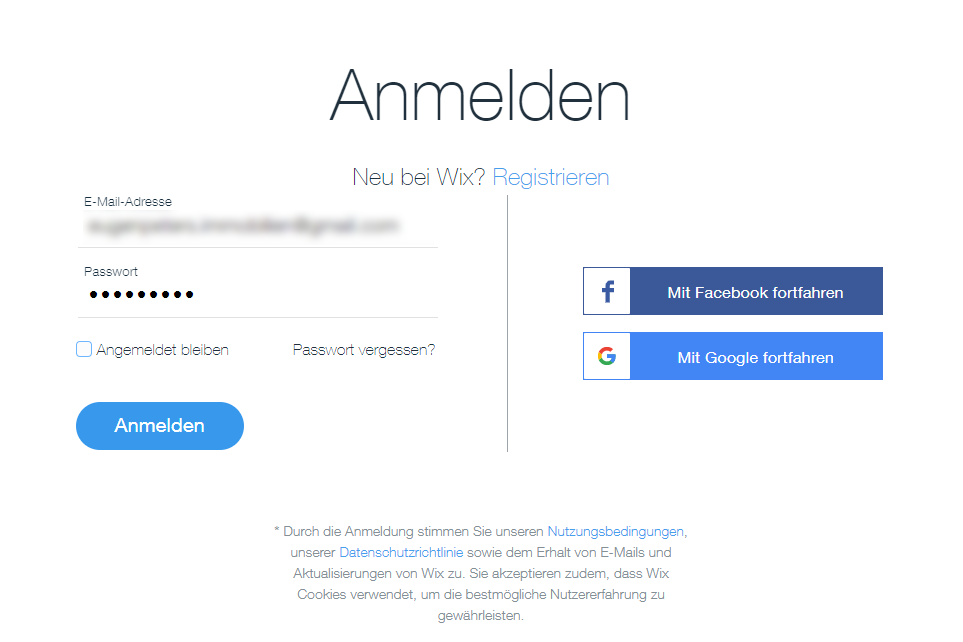
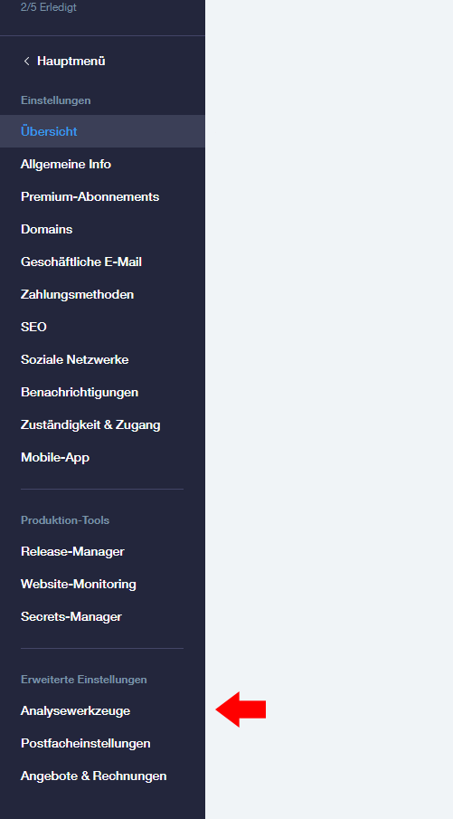
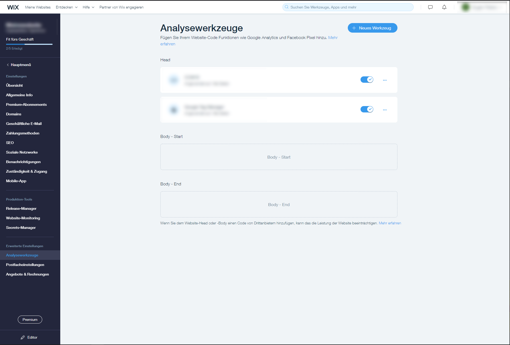
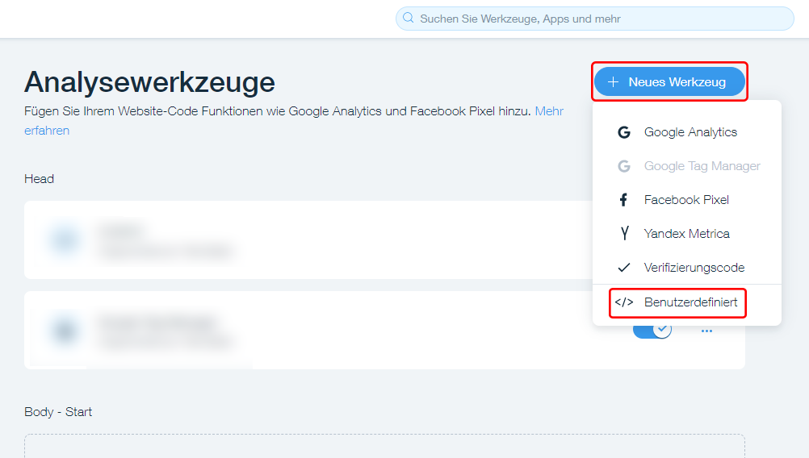
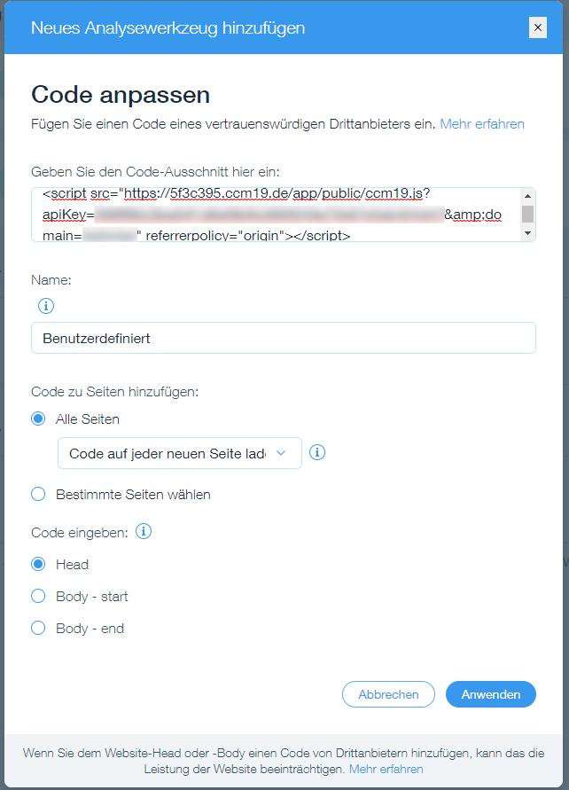

# Wix

To install our Cookie [Consent](https://www.ccm19.de/integration/glossar/10-Consent.html#10) Manager for your Wix blog or website, simply follow the steps below:

## Log in to WIX Account

## Select website

In the overview for the web pages, select the web page in which you want to embed CCM19.

## Open the website administration

Open the settings in the administration for the web pages.

## Open analysis tools

In the settings overview, open the "Analysis tools" item in the "Advanced settings" area.

## Insert CCM19 in the header area

Now you see three areas where you can add tools. We want to add the CCM19 in the header area, in the first place.

## Select new tool

Click on "+ New Tool" and select "Custom".

## Install tool

First, choose a name for the tool, e.g. "CCM19". Next, in the code section, add the script for CCM19 (the image is just an example). Then, in the "Add code to page" section, select "all pages" and that the code will be reloaded on each page. Now select the head area as output. After saving the tool, make sure that CCM19, is in the first position and no other tool is positioned before it.

## Done

Et voilà, now Cookie Consent Manager should be included on your website and show cookie messages when the widget is enabled in the tool itself. Now you just need to configure it for your website.