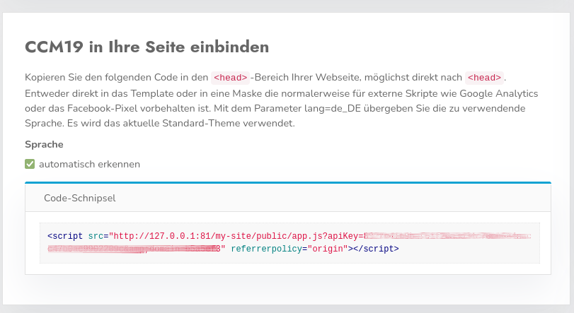
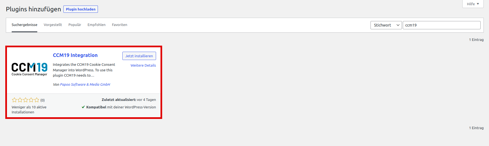
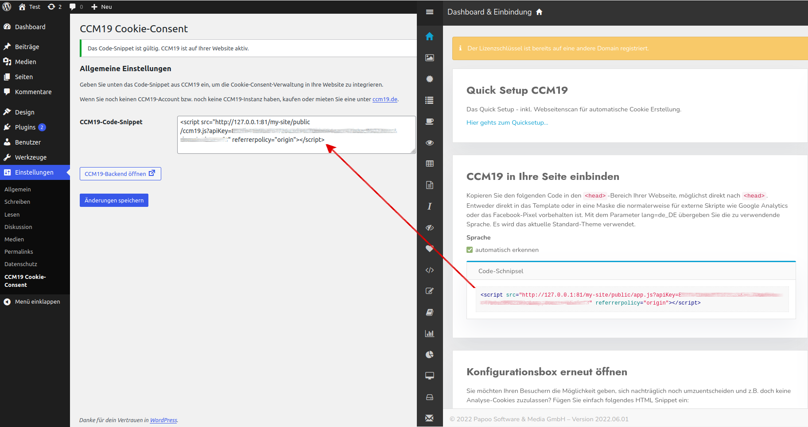

# WordPress

Um den [Cookie Consent Manager](https://www.ccm19.de/integration/glossar/10-Consent.html#10) von Papoo Software & Media GmbH für Ihren WordPress-Blog oder Ihre WordPress-Webseite zu installieren, führen Sie einfach die folgenden Schritte aus:

## Dashboard in CCM19 anwählen

Melden Sie sich bei Ihrem CCM19 Tool an und suchen Sie auf dem Dashboard den Punkt "CCM19 in Ihre Seite einbinden". Dort ist der Code-Schnipsel für Ihre CCM19 Installation hinterlegt.

 

## In WordPress einloggen

Für die Integration des Cookie Consent Managers in eine WordPress-Webseite, müssen Sie nur ein Plugin hinzufügen. Loggen Sie sich in Ihre WordPress-Seite ein, wie Sie es gewohnt sind.

 

## Plugin auswählen

Wählen Sie zur Installation des Plugins "CCM19 Integration" auf der linken Seite Ihrer WordPress-Verwaltung den Menüpunkt "Plugins" und darunter den Punkt "installieren" aus. Auf der rechten Seite (Oben) geben Sie nun die Stichwörter "CCM19" ein bzw. suchen danach. "CCM19 Integration" ist ein kostenloses Plugin für WordPress, welches den CCM19 in WordPress integriert. Installieren/Aktivieren Sie das Plugin für Ihre Webseite.

 

## Plugin einstellen

Im Menü auf der linken Seite sollte nun ein neuer Menüpunkt unter Einstellungen ("CCM19 Cookie-Consent") auftauchen. Klicken Sie auf diesen Menüpunkt und fügen Sie dort dann den Codes-Schnipsel vom CCM19 Dashboard ein. Drücken Sie jetzt "Änderungen Speichern".

## Fertig

Et voila, nun sollte der Cookie Consent Manager auf Ihrem WordPress-Blog installiert sein und Cookiemeldungen einblenden.

 