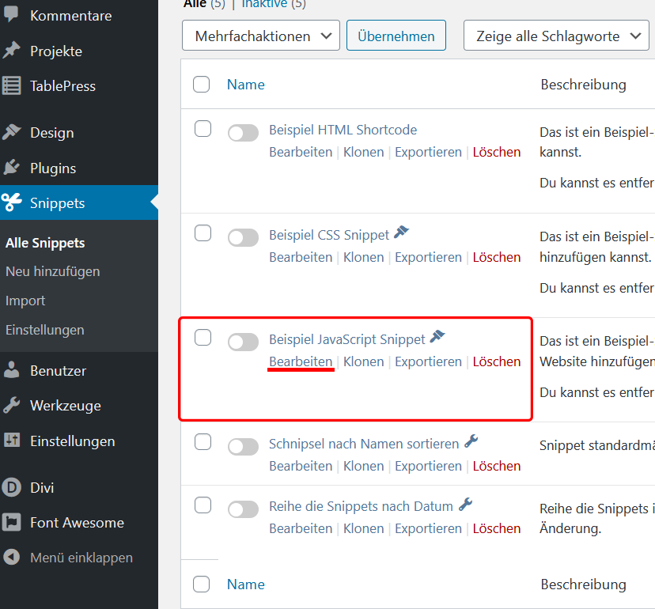
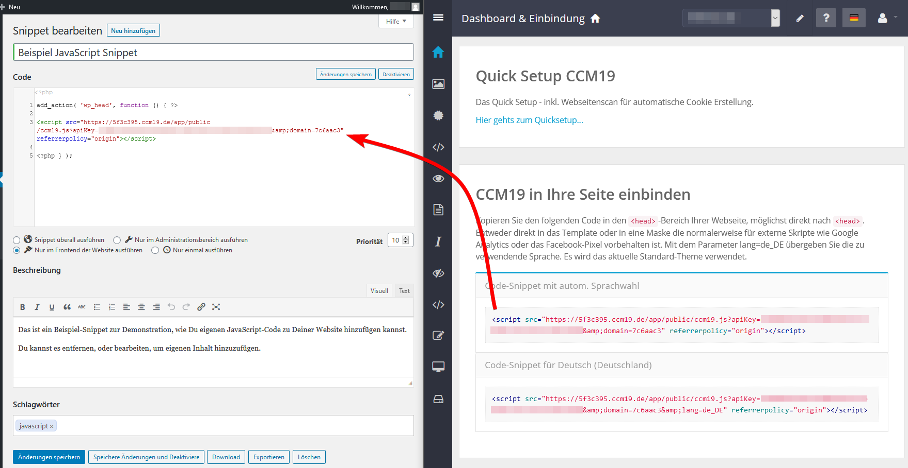

# WordPress

To install Papoomedia's Cookie [Consent](https://www.ccm19.de/integration/glossar/10-Consent.html#10) Manager for your WordPress blog or website, simply follow the steps below:

## Select Dashboard in CCM19

Log in to your CCM19 tool and on the dashboard, find the "Include CCM19 in your site" item. There you will find the "code snippets" for your CCM19 installation. For our test installation we use the "Code-Snippet with autom. language selection".

 

## Log in to WordPress

To integrate Cookie Manager into a WordPress website, your website must be able to integrate codes or scripts into the head section of all pages and subpages. WordPress has free plugins available for this purpose. Log in to your WordPress site as you are used to.

 

## Select plugin

To install the plugin "Code Snippets", select the menu item "Plugins" on the left side of your WordPress administration and below that the item "install". Now on the right side (Top) enter or search for the keywords "Code Snippets". "Code Snippets" is a free plugin for WordPress, which allows you to integrate any code into your WordPress website. Install/activate the Code Snippet plugin for your website.

 

## Set plugin

A new menu item ("Snippets") should now appear in the menu on the left. Click on this menu item and then on the right side on the link "**Example JavaScript Snippet**".

## Insert code

Paste the snippet code provided by Cookie Consent Manager where the new snippet says "/* Write your JavaScript code here */". Don't forget to click "Save changes and activate".

 

## Done

Et voila, now Cookie Consent Manager should be installed on your WordPress blog and show cookie messages.

 