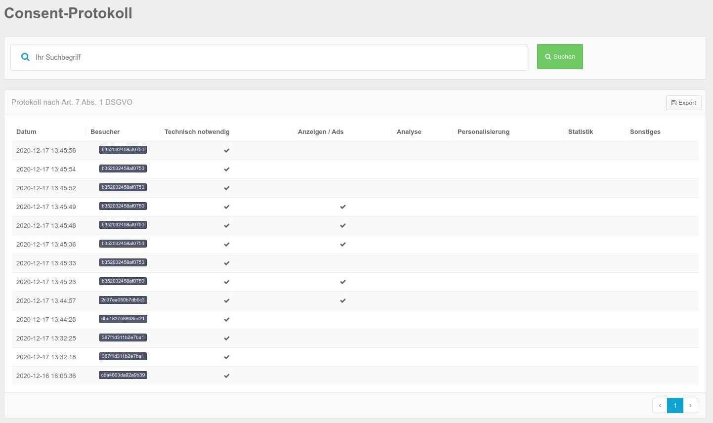
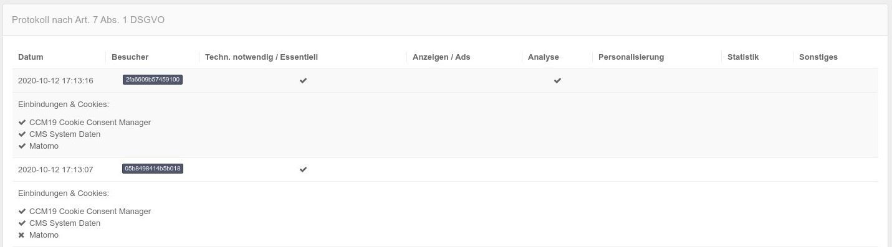
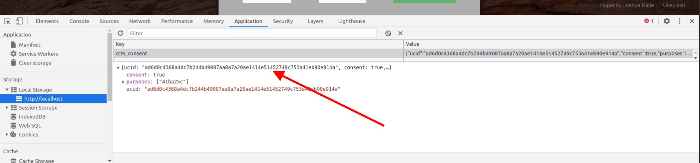
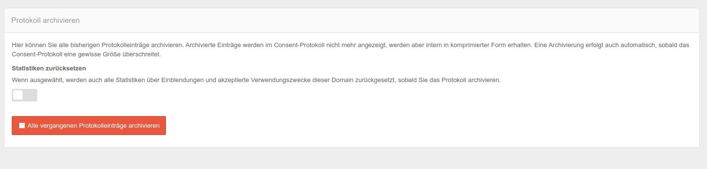

# Consent protocol

The consents of all visitors are clearly listed. By means of an ID, visitors can be clearly identified if they wish to receive information about their activated data **and** inform you of their own ID. Without this information, the data remains completely anonymous because the ID is a random number.

The logging is mandatory according to DSGVO Art 7, para 1. Of course, these - as well as all other data - always remain under your control and are completely anonymized.



In the overview you can see how often the respective areas were checked. In the mask used in this example, only the two areas Essential and Analysis were offered - therefore, only there are ticks to be recorded.

## Export

With the Export button you can export the Consent data of the respective month by clicking on the button in .json format. An example entry looks like this - you can see here the ucid - with which your visitors can identify themselves.

``json
{
        "consent": true,
        "ucid": "387f1d311b2e7ba1f67722ac08bfdaf56aad3ecab6f11309d0c829f4e255af12",
        }, "timestamp": 1608208345,
        "purposes": {
            "41ba25c": "technically necessary"
        },
        "embeddings": {
            "16bd7f0": "Papoo CMS Session Management"
        },
        "manipulationPrevention": true
    }
```


## Consent Details

For each entry also Consent Details are stored. So whether in the individual categories also individual scripts / bindings were checked 




## Use Consent Protocol for requests

If you receive a request regarding DSGVO whether you can prove the consent, the requester must tell you his ID. You can then search for this ID using the search mask.

He will find this ID in the Consent mask at the following position. To do this, he must open the Consent mask, click on Settings (if not already open), then on the question mark next to one of the categories.


## Alternative query of the ID

Alternatively, the ID can always be taken in the developer tools as shown in the screenshot. The data can be found in the Application tab - &gt; there left click on Local Storage and then select your own domain.




# Storage duration Consent

Since the Consent is stored for 1 year, the data of the Consent is also stored for this time. After the expiration of this year plus 1 month grace period, the data is deleted. Thus, the DSGVO should also be satisfied at this point.

## Archive log

Here you can archive all previous log entries. Archived entries are no longer displayed in the Consent log, but are retained internally in compressed form. Archiving also occurs automatically as soon as the Consent log exceeds a certain size.



### Reset statistics

If selected, all statistics about insertions and accepted uses of this domain will also be reset once you archive the log. So the data will be archived from the listing here.

