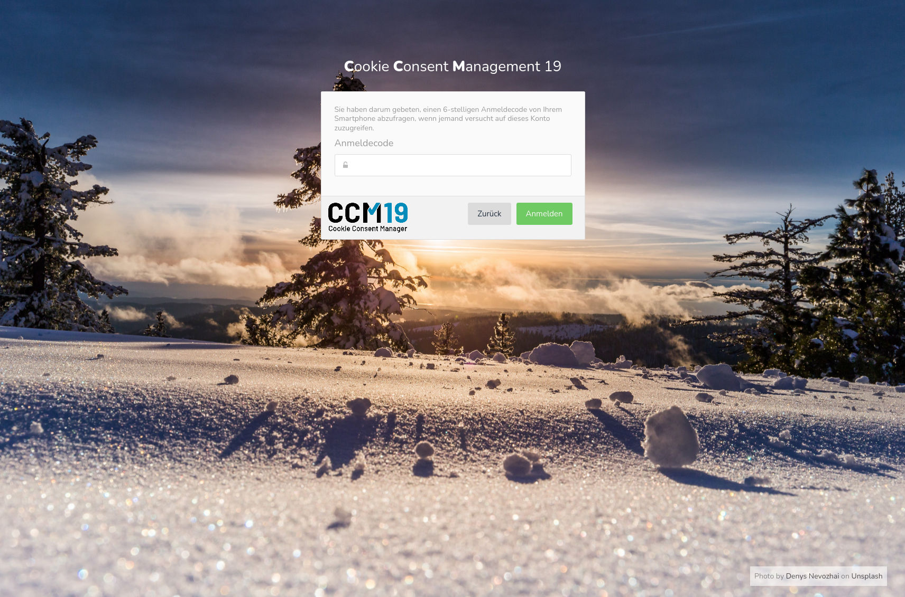
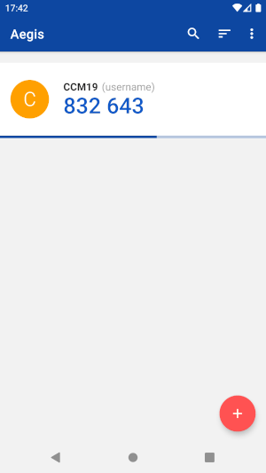

# 2-factor authentication

With this plugin you can additionally secure the login of your account by still requesting a changing login code after the password request, which is generated on your smartphone or tablet. Only the new login with expired session in a browser window, in which the CCM19 backend is still open, is excluded from the code entry.

The plugin must be activated in the on-premise editions in the plugin management by the administrator and enabled for users.
In the Cloud plans, the plugin will be available during January 2022.

## Enable functionality

Log in to CCM19 and open the "Account Settings" from the user menu in the top right corner.

There, click on "Enable 2-factor authentication with a smartphone app" at the bottom.
If this button is missing, the plugin is not active or not yet enabled for you.

After you have clicked on the button, a configuration area opens with a randomly
generated key and a QR code.

Install an authentication app on your smartphone if you don't already have one.
A selection of supported apps is linked in the introduction text of the form.

In the following, the process is demonstrated using the app "Aegis Authenticator" (available in the Google Play Store and the FDroid Store).
The process is largely comparable in other apps.

Open the authentication app on your smartphone and scan the QR code.
If you have opened the CCM19 backend directly on your smartphone, double-tap the QR code instead.

The app should automatically import the necessary parameters by scanning the code.
If that doesn't work, you can also transfer the data manually from the left pane next to the QR code.

Finally, press "Save." You should now see a 6-digit code that changes every 30 seconds.

Type the generated code in the "Login code" field and then click "Activate".
You have about 30 seconds to click the button after the code has changed in the app.

If everything worked, you will see a message "2-factor authentication successfully enabled."

After that, you will need a current login code from your app for each login in CCM19.

## Disable functionality

Log in to CCM19 and open the "Account Settings" via the user menu in the upper right corner.

There, click "Disable 2-factor authentication with a smartphone app" at the bottom.

Enter a current login code from your app and then click "Disable".

If everything worked, you will see a message "2-factor authentication successfully disabled."
and you no longer need a login code to log in to CCM19.

## What can I do if I no longer have access to the app?

If you can no longer create login codes, use the "Forgot your password?" feature
in the login window of CCM19.

You will then receive an email. Follow the instructions in the mail to set a new password
new password. The new password also resets the 2-factor authentication.
