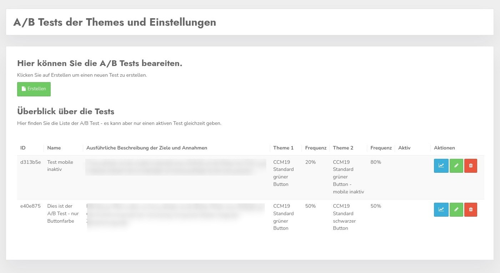
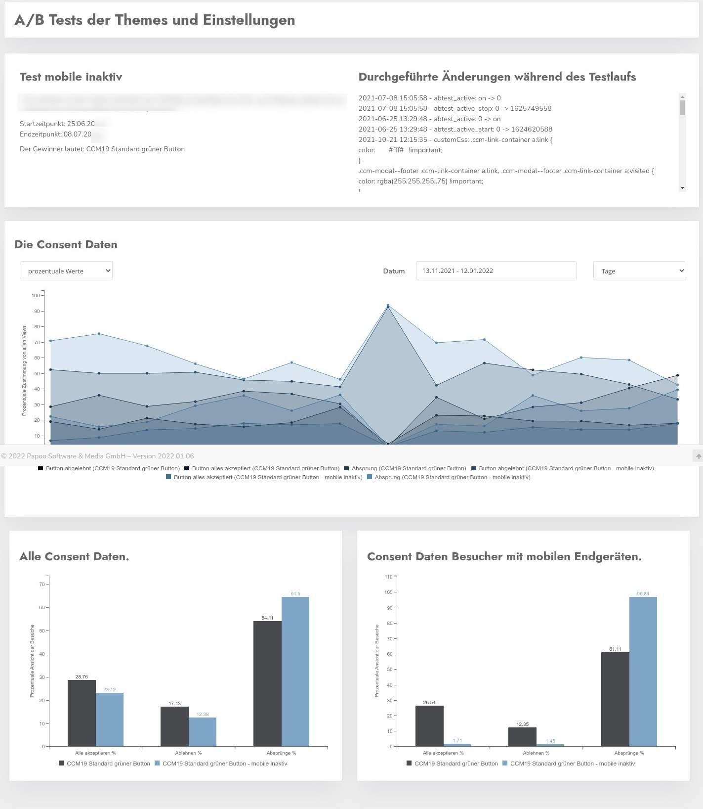

# A/B tests

With this plugin you can run A/B tests with the widget in the frontend. In principle, this works so that you run 2 themes against each other and see which gives the best results.

## Create / edit test

To create a new test click on the green button "Create", in the same only pre-filled mask you come if you click on the green pen in the listing to edit the settings of a test.

Here you can select which theme should be displayed in which frequency. So you can e.g. show a new theme to only a few visitors to test how well it works.

The proportional frequency is entered as a percentage in the corresponding fields "Frequency". Only if you set the hook "activate" the test is active. There can only be one active test at a time, if you check the box and another test is active the previous one will be deactivated.

You can see whether a test is active in the overview in the screenshot above.

## Evaluation

If you click on the blue button with the curve in the overview, you will get to the evaluation of the test. Here the data of the two variants are displayed against each other. Due to the positive click rate, a winner is automatically displayed.

In the right column above the graph you can see the change history of the test, i.e. which changes were made to the two themes used and when.

