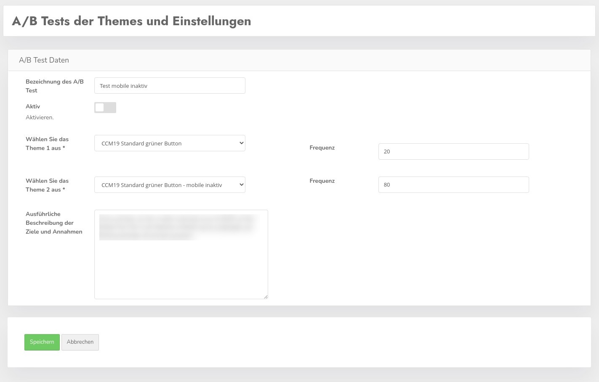

# A/B Tests

Mit diesem Plugin können Sie A/B Tests mit dem Widget im Frontend durchführen. Prinzipiell funktioniert das so, dass Sie 2 Themes gegeneinander laufen lassen und schauen welches die besten Ergebnisse liefert.

## Test erstellen / bearbeiten

Um einen neuen Test zu erstellen klicken Sie auf den grünen Button "Erstellen", in die gleiche nur vorausgefüllte Maske kommen Sie wenn Sie im Listing auf den grünen Stift klicken zur Bearbeitung der Einstellungen eines Tests.

Sie können hier auswählen welches Theme in welccher Frequenz angezeigt werden soll. So können Sie z.B. auch ein neues Theme erstmal nur wenigen Besuchern zeigen um zu testen wie gut das funktioniert.

Die anteilige Frequenz wird prozentual in den entsprechenden Feldern "Frequenz" eingetragen. Erst wenn Sie den Haken "aktivieren" setzen ist der Test aktiv. Es kann immer nur einen aktiven Test geben, wenn Sie den Haken setzen und ein anderer Test ist aktiv wird der vorherige deaktiviert.

Ob ein Test aktiv ist sehen Sie in der Übersicht im Screenshot oben.

## Auswertung

Wenn Sie in der Übersicht auf den blauen Button mit der Kurve klicken kommen Sie zur Auswertung des Tests. Hier werden die Daten der beiden Varianten gegeneinander dargestellt. Aufgrund der postiviven Klickrate wird automatisiert ein Gewinner dargestellt.

In der rechten Spalte über der Grafik sehen Sie den Änderungsverlauf des Test, also welche Änderungen wann an den beiden genutzten Themes durchgeführt wurden.

