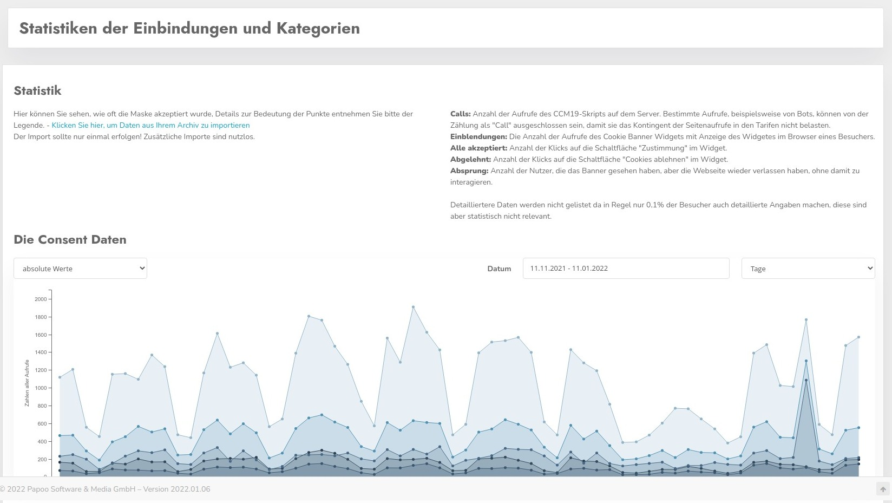
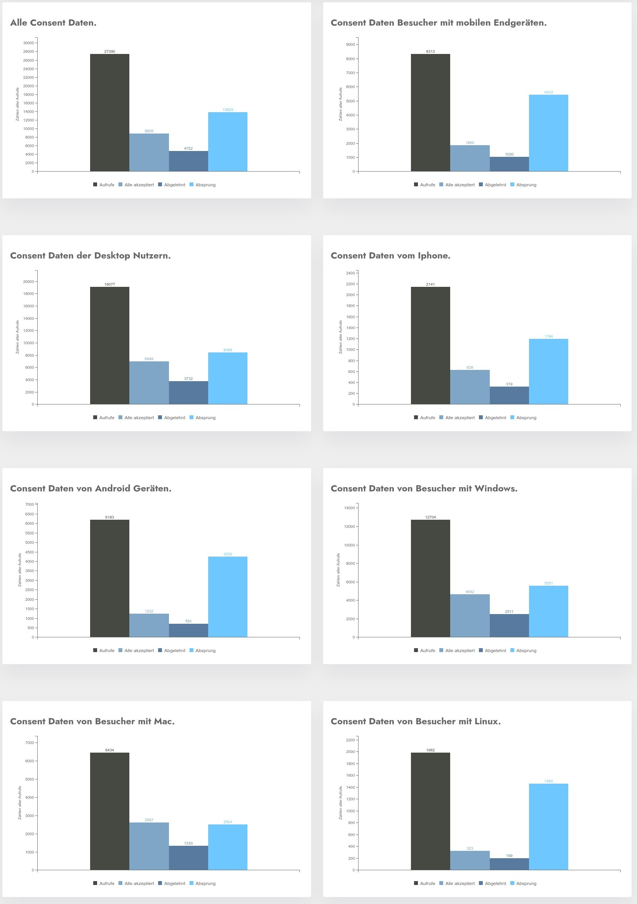

# Advanced statistics

With the help of the extended statistics you can further evaluate the statistical Consent data. The data here is completely anonymized - it is not possible to draw conclusions about individual data records.

## Overview of the statistics

Here you can see the data of a sample page from one of our many customer sites that were kindly made available to us, it is a pure info page from the agricultural sector. But this is not relevant for the explanation of the interface in the end.

## Use of the mask

On the top left you can select whether the data should be displayed absolutely - i.e. the pure numbers or as a percentage.

The percentage values are available but for the past but only for some short periods because very long only the approvals were logged, but no insertions. They were only counted for the respective month for the accounting and then discarded 

If no percentage values are available, a 0 is displayed in each case.

## Select period

You can select the time period via the two selection fields in the upper right corner and the cummulation to days, weeks, months or years.

## Interpretation of the data

In principle it is now so that the number of insertions is calculated from all insertions of the mask, also the visitors who jump off again directly and do not operate the mask are counted with, in addition all those with the mask interact.

## Please note

The number of insertions is only a subset of the number of uses of CCM19. The script runs on **every** page request because it always has to check if there is a consent or not. Only if there is no consent, the mask will be output and the above number of insertions will be counted.

## What do the numbers mean?

- **Calls:** Number of calls of the CCM19 script on the server. Certain calls, for example from bots, may be excluded from being counted as "calls" so that they do not burden the quota of page views in the tariffs.
- **Inserts:** The number of times the cookie banner widget was called with the widget displayed in a visitor's browser.
- **All Accepted:** Number of clicks on the "Agree" button in the widget.
- **Rejected:** Number of clicks on the "Reject Cookies" button in the widget.
- **Dropped:** Number of users who saw the banner but left the website without interacting with it.

More detailed data is not listed because usually only 0.1% - 1% of visitors also provide detailed information, but this is not statistically relevant.

## Problems with the presentation of the data

Sometimes there can be problems with the processing of the data, then click on the link "Import data from archive". This problem occurs if then only in the download versions.

## Data selected by operating system and browser

Since this data is always transmitted anyway, it can be displayed and evaluated without any problems. A DSGVo / personal reference does not exist.

