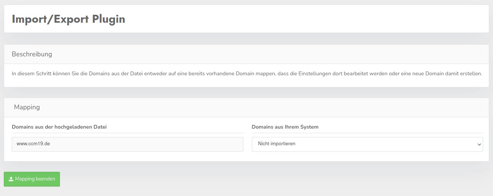

# Import / Export plugin

With this plugin you get the possibility to export certain data from a domain or directly several domains from a CCM19 installation via the backend and to import this data again. All exported data will be output as .json files and can be customized by hand of course.

## View in the domain overview

If you are in the overview of your domains, you have there the possibility to export selected domains of your account and to import single to several domains. At this point only all data of a domain can be exported, but in the view of the domain itself you have the possibility to export single parts of a domain.

### Import

After trying to import one or more domains in the overview, in order to be able to control the import completely, you can choose what should happen to each domain from the uploaded file.

Now as an option for each domain you can either overwrite a domain by selecting the name of it, add a new domain or decide not to do anything with any domain from the file.

## View in the domain

When using the plugin in a domain, you now have the ability to export and re-import individual parts of a domain. But pay attention to the info buttons for single points, because these could be important information about the behavior.

## Notes

You have the possibility to use an export file with several contained domains also in the import of the view in a single domain, but only the currently active domain can be overwritten there. Likewise, it is also possible to use the file from the view of a single domain the other way around, even if not all data is necessarily included in this export, the data that is in the file will be used.