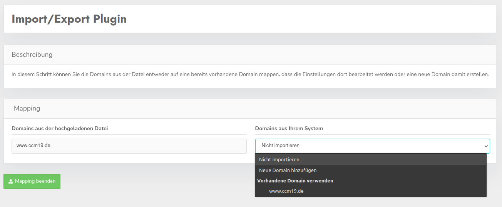

# Import / Export Plugin

Mit diesem Plugin bekommen Sie die Möglichkeit, bestimmte Daten aus einer Domain oder mehrere Domains aus einer CCM19-Installation zu exportieren und diese Daten wieder importieren zu können.

## Ansicht in der Domain-Übersicht

Wenn Sie sich in der Übersicht Ihrer Domains befinden, haben Sie dort die Möglichkeit ausgewählte Domains Ihres Accounts zu exportieren und einzelne bis mehrer Domains zu importieren. An dieser Stelle lassen sich nur alle Daten einer Domain exportieren, jedoch ahebn Sie in der Ansicht der Domain selbst die Möglichkeit, einzelne Teile einer Domain zu exportieren und zu importieren.

### Import

Nach dem Versuch eine oder mehrere Domains in der Übersicht zu importieren, können Sie sich, um den Import komplett kontrollieren zu können, aussuchen was mit jeder Domain aus der hochgeladenen Datei pasieren soll.

Nun können Sie als Möglichkeit für jede Domain entweder eine Domain überschreiben, indem Sie den Namen dieser auswählen, eine neue Domain hinzufügen oder sich entscheiden, nichts mit einer Domain aus der Datei zu machen.

## Ansicht in der Domain

Wenn Sie das Plugin in einer Domain verwenden, haben Sie nun die Möglichkeit, einzelne Teile einer DOmain zu exportieren und wieder zu importieren