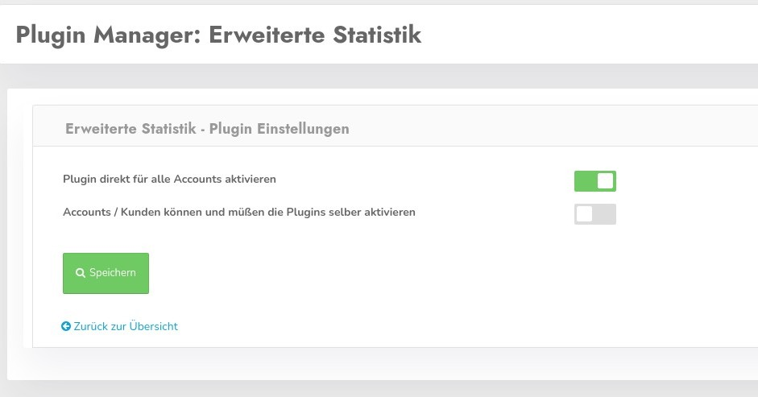

# Plugins in CCM19

Plugins extend the basic functions of the CCM19 Cookie Consent Manager with arbitrary functions 

## Why should this be necessary at all? 

1. There are always functions that are desired by some, but many do not need. So that we do not continue to plaster the basic functions of the CCM19 tool with functions that only some customers need, we have created a possibility for this.
2. As a result of the Privacy Shields ruling and in the context of the DSGVO it is often not possible to realize arbitrary data or integration into the own website or store. With the help of CCM19 at least basic functions of external service providers can be restored, and that even DSGVO compliant.

## Where can I find the plugins

Available plugins can be found in the administration under the tab "Plugin Manager", there you will find a listing in 2 tabs 

## Installed plugins

Here you can find the list of installed plugins as shown in the screenshot.

The click on Settings opens the following mask

You can activate the plugin directly for all accounts. In the download version the check mark is always set - because there is only one user.

With the setting "Accounts / customers can and must activate the plugins themselves" you pass the responsibility for the use to your customers. This function is not active in the OnPremise version - since there is only 1 user.

**Available plugins can be found in the menu on the left.**

