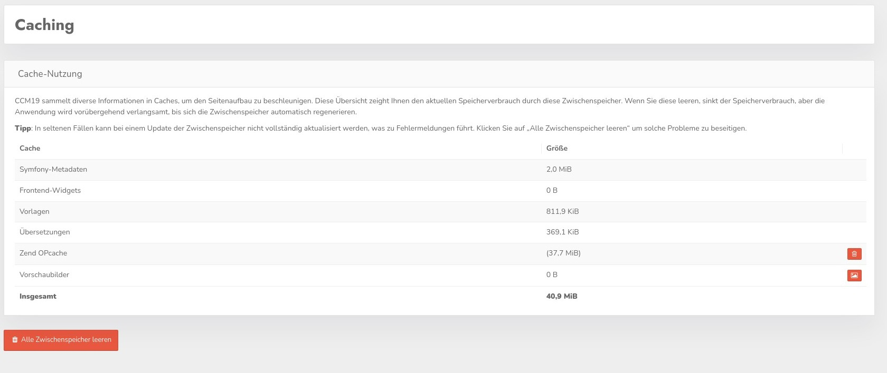

# Caching

CCM19 uses intensive caching of all components to provide the necessary data as fast as possible. Time is money and if page loads take too long, visitors will bounce.

On the screenshot you can see the different caches of CCM19 and how busy each cache is.

**Not included in Fullservice**

This function is not available in the Fullservice variant **individual customers** because it is used by CCM19 globally across all accounts. This function is also performed regularly on the server side.

## Clear cache

You can clear the cache of the installation by clicking on the red button "Clear all cache". This only deletes the temporary files, there is no effect on the function. The cache will be completely recreated the next time you open the page.

You can also delete the caches Zend OPCache and the preview images individually if there are special problems.

&gt; If you notice an unusual problem in your CCM19 installation, clear the cache once as a first step and test if it is already solved. This often happens.

