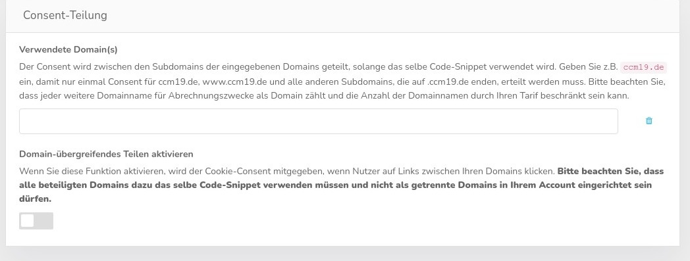

# Consent Speicherung

CCM19 kann die Daten für den Consent sowohl in einem Cookie, im Local Storage oder auch im Session Storage speichern. Die einzelnen Methoden haben Vor- und Nachteile.

.jpg)

### Speicherung als Cookie

Den Consent in einem Cookie zu speichern, erlaubt das Teilen des Consents über mehrere Subdomains und verschiedene Ports, aber kann die Seitenladezeit geringfügig verlängern. Das ist die klassische Speicherung der Daten.

### Speicherung im Local Storage

Den Consent im Local Storage zu speichern erlaubt es die Information in vielen Browsern unbegrenzt zu erhalten. Dabei wird der Consent aber auf eine Hostnamen-Port-Kombination beschränkt.

### Speicherung im Session Storage

Den Consent im Session Storage zu speichern, hält den Consent für jeden Browser-Tab getrennt. In dem Moment in dem der Tab geschlossen wird, wird auch der Consent vergessen.

## Eigenschaften des CCM19 Elements

.jpg)

Über die Maske können Sie festlegen wie lange das CCM19 Cookie gespeichert werden soll. Standard sind 356 Tage = 1 Jahr ;-). Wenn Sie eine 0 eintragen, wird das Cookie beim Schließen des Browsers gelöscht.

Die Option für "sichere" Cookies sollte nur deaktiviert werden, wenn HTTPS/SSL nur optional verwendet wird und ermöglicht dann, dass der Consent zwischen der Seite ohne HTTPS und der mit HTTPS geteilt wird. Dies ist aber heutzutage extrem selten. Zudem kann das Abschalten dieser Option aufgrund der Sicherheitsfunktionen moderner Browser bei den restlichen Consent-Teilungs-Funktionen und beim Einbetten der Website in IFrames Probleme verursachen.

## Consent-Teilung

Mit CCM19 ist es möglich den Consent unabhängig von Third-Party-Cookies über beliebig viele Domains und Subdomains hinweg zu teilen. Tragen Sie dazu die Liste der gewünschten Domains in das Feld ein.

> Diese Funktion steht nur in der Fullservice, Inhouse-CMP- und Agency-Variante zur Verfügung.

Für jede eingetragene Domain kann der Consent zwischen den Subdomains der eingegebenen Domain geteilt werden, solange das selbe Code-Snippet verwendet wird. Geben Sie z.B. <code>example.com</code> ein, damit nur einmal Consent für example.com, www.example.com und alle anderen Subdomains, die auf .example.com enden, erteilt werden muss. Ungültige Eingaben können dazu führen, dass das Speichern des Consents nur noch unzuverlässig funktioniert

Der Consent wird über HTML-Links, HTML-Formulare und IFrames weitergeben.

### Consent-Teilung im IFrame

Falls Sie eine Webseite haben, bei der ein IFrame einer anderen ihrer Seiten eingesetzt wird, z.B. eine Buchungsmaske, erscheint dann in dem IFrame nicht nochmal eine Abfrage, sondern der Consent wird übertragen. Dies funktioniert natürlich nur, wenn sie oben eingetragen sind und somit auch die gleichen Skripte und Cookies teilen.

## Cookie Reset erzwingen

Mit diesen Einstellungen kann man erzwingen dass alle Besucher die Ihren Consent vor diesem Datum gesetzt haben, den Consent neu erteilen müssen. Dies kommt vor wenn man die Maske geändert hat und den Consent neu bekommen möchte, auch für Bestandsbesucher.

Wenn Sie hier ein Datum eintragen, werden alle Consents die vor diesem Datum gesetzt wurden von Ihren Besuchern zwangsweise zurück gesetzt und die müssen die Maske neu abnicken.

Wird die Option "Consent automatisch bei rechtlich relevanten Änderungen aufheben" aktiviert, führen rechtlich relevanten Änderungen an Einbindungen und Cookies dazu, dass eine Einwillungung nicht mehr gilt und erneut abgefragt wird. Dazu gehören folgende Änderungen:

Embeddings:
Name
Zweck
Hersteller/Anbieter (Auch TCF-Anbieter)
TCF-
Beschreibung
Datenschutz-URL
Gesammelte Daten
Zweck der Sammlung
Rechtliche Grundlage
Ort der Verarbeitung
Cookie & Co. (Hinzufügen/Löschen/Beabeiten [Siehe EmbeddingAsset])
Google Consent Mode Zustimmungen
TCF Zwecke
TCF besonderen Verarbeitungsmöglichkeiten