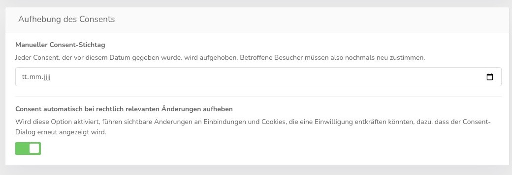

# Consent storage

CCM19 can store the data for the consent in a cookie, in the local storage or in the session storage. Each method has advantages and disadvantages.

.jpg)

### Storage as cookie

Storing the consent in a cookie allows sharing the consent across multiple subdomains and different ports, but may slightly increase the page load time. This is the classic way of storing the data.

### Storage in local storage

Storing the consent in local storage allows the information to be retained indefinitely in many browsers. However, the consent is limited to a hostname-port combination.

### Storage in session storage

Storing the consent in the session storage keeps the consent for each browser tab separate. The moment the tab is closed, the consent is also forgotten.

## Properties of the CCM19 element

.jpg)

The mask allows you to specify how long the CCM19 cookie should be stored. Default is 356 days = 1 year ;-). If you enter 0, the cookie will be deleted when you close the browser.

The option for "secure" cookies should only be disabled if HTTPS/SSL is only used optionally and then allows the consent to be shared between the page without HTTPS and the one with HTTPS. However, this is extremely rare nowadays. Moreover, due to the security features of modern browsers, disabling this option can cause problems with the rest of the Consent sharing features and when embedding the website in IFrames.

## Consent Sharing

With CCM19 it is possible to share the Consent across any number of domains and subdomains independently of third-party cookies. To do this, enter the list of desired domains in the field.

&gt; This function is only available in the Fullservice, Inhouse-CMP and Agency variants.

For each domain entered, the Consent can be shared between the subdomains of the domain entered, as long as the same code snippet is used. For example, enter example. <code>com</code> so that Consent only needs to be granted once for example.com, www.example.com and all other subdomains ending in .example.com. Invalid entries can lead to unreliable saving of the Consent

The Consent is passed on via HTML links, HTML forms and IFrames.

### Consent sharing in IFrame

If you have a website where an IFrame of another of your pages is used, e.g. a booking mask, then a query does not appear again in the IFrame, but the Consent is transferred. Of course, this only works if they are entered above and thus also share the same scripts and cookies.

## Force cookie reset

With these settings you can force that all visitors who have set their consent before this date, must give the consent again. This happens if you have changed the mask and want to get the consent again, even for existing visitors.

If you enter a date here, all consents that were set before this date will be forced back by your visitors and they will have to re-sign the mask.