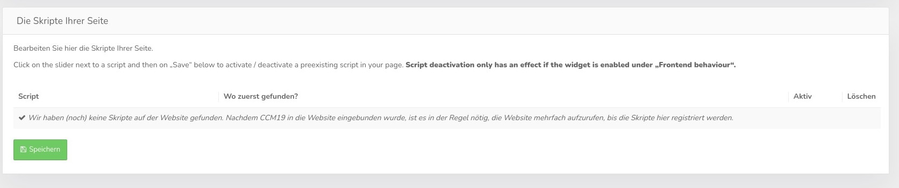

# Developer settings

If you are not a developer, please do not change anything. The best options are chosen to work very well. These are very specific settings for developers, only change if you really know what AND why you are doing this.
**Some of these settings can make your site unusable, test everything - always


## Switch management structure

CCM19 is set by default that customers / visitors to your website agree or not the scripts in the block with the associated cookies. As an example here is Google Anayltics, you can agree or not to its use, but not to the use of individual cookies, it simply does not make sense technically.

The old CCM19 version still allowed this, but that was changed a long time ago. Some old versions still use the outdated cookie setting, so we offer the possibility to change that here.


## Remove unknown cookies

CCM19 can be configured to remove cookies that are not stored in the tool as soon as they are noticed.

Of course this only works for first party cookies. Third party cookies that are e.g. embedded by iframes can not be technically touched by the own site and therefore can not be deleted. This is prevented by the security settings in your browser - which is absolutely correct!

Therefore you have to block these scripts or iframes before they are executed - also before they set the cookies.

**Think about it, if you find every cookie used on your site? For example, if you use a shopping card cookie that is not listed in CCM19, it will be blocked -&gt; NO SUCKS!!!** 

**Therefore, the rule here is TEST! TEST! TEST!**


## Block scripts

Here you can configure the behavior of the script blocker. This function blocks the loading of scripts that are not under the control of CCM19. This way the setting of unwanted cookies is automatically prevented as well as the execution of unknown scripts.

### Block new scripts automatically

If this checkmark is enabled, new scripts found by CCM19 will be disabled and blocked directly. Please be careful with this hook, it can also prevent necessary functions that you may not have entered as desired 

### Block scripts of your own domain too

If this checkmark is set, all scripts also of the own domain will be blocked if they are newly found. Example:

`` html
<script type="text/javascript" src="/js/main.js" defer="defer"></script>
```

### Block inline scripts as well

If this checkbox is set, inline scripts that are built into your page as snippets will also be disabled when they appear on the page - example:

`` javascript
<script type="application/javascript">
  window.onload = function()
   {
     window.localStorage.clear();
   }
</script>
```

## Exceptions for inline scripts

If scanning for inline and custom scripts is enabled in CCM19 (not recommended because very resource hungry), you can enter exceptions there due to special snippets not to be considered anymore.


# Found scripts

Here you can find a list of all external scripts that the automatic scanner of the CCM19 widget finds on your page.




## Listing of the scripts

The listing shows you which scripts can be found on your page, it shows the whole code snippet. Furthermore a link shows where the script was found for the first time and if it is active 

The red button delete removes the script from this listing - it does **not** remove the script from your page, it remains there and executable.

## Disable scripts

You can manually and globally disable the found scripts here. For example, if you do not have 100% control over the source code of the page, as is the case with many cloud providers, you have the ability to access it here and disable bindings.

To disable a script, set the checkmark to inactive. This will block it in the frontend as long as the CCM19 widget is active.

