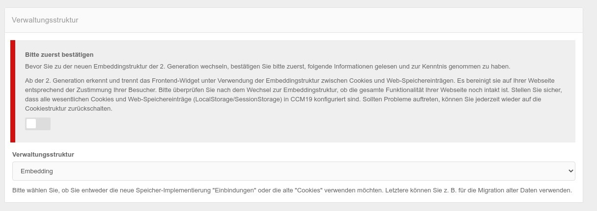

# Developer Einstellungen


# Gefundene Skripte

Unter dem Menüpunkt Skripte finden Sie eine Auflistung aller externen Skripte die der automatische Scanner des CCM19 Widgets auf Ihrer Seite findet.

## Skripte deaktivieren

Sie können die gefundenen Skripte hier manuell und global deaktivieren. Wenn Sie z.B. keine 100%ige Kontrolle über den Quellcode der Seite haben, wie es z.B. bei vielen Cloud Anbietern der Fall ist, haben Sie hier die Möglichkeit darauf zu zugreifen und Einbindungen zu unterbinden.

Um ein Skript zu deaktivieren, setzen Sie den Haken auf inaktiv. Damit wird es dann im Frontend solange geblockt wie das CCM19 Widget aktiv ist.


## Auflistung der Skripte

Die Auflistung zeigt Ihnen welche Skripte auf Ihrer Seite zu finden sind, es wird dabei der gesamte Codeschnipsel angezeigt. Weiterhin zeigt ein Link wo das Skript zum ersten mal gefunden wurde, und ob es aktiv ist. 

Der rote Button löschen entfernt das Skript aus diesem Listing - es führt **nicht** dazu dass das Skript aus Ihrer Seite entfernt wird, dort bleibt es weiterhin erhalten und ausführbar.


## Ausnahmen für Inline-Skripte

Wenn im CCM19 das scannen auch nach inline und eigenen Skripten aktiviert ist (nicht zu empfehlen da sehr ressourcenhungrig), können Sie dort Ausnahmen eintragen aufgrund spezielle Schnipsel nicht mehr beachtet werden sollen.


## Unbekannte Cookies entfernen

CCM19 kann so konfiguriert werden, dass Cookies, die im Tool nicht hinterlegt sind, entfernt werden, sobald sie bemerkt werden.

Das funktioniert natürlich nur für First Party Cookies. Third Party Cookies die z.B. von iframes eingebunden werden können von der eigenen Seite technisch leider nicht angefasst und daher auch nicht gelöscht werden. Das verhindern die Sicherheitseinstellungen in Ihrem Browser - das ist so auch absolut richtig!

Daher muss man diese Skripte oder iframes blocken bevor sie ausgeführt werden - also auch bevor sie die Cookies setzen.


## Verwaltungsstruktur umstellen

Durch neuere rechtliche Vorgaben hat sich eine andere Struktur der Darstellung im Frontend ergeben. Diese Darstellung orientiert sich an den Skripten oder auch Einbindungen die jeweils 1 - x Cookies setzen, Local Storage Elemente und weiter Punkte setzen.

Um den Umstieg zu erleichtern kann man jederzeit zwischen den verschiedenen Bereichen umstellen. Je nach Einstellung stellen sich sowohl die Cookie Masken als auch die Frontend Widgets anders da. Die aktuelle Dokumentation beschreibt nur die neue Variante da nur diese weiter entwickelt wird.




Sie können hier zwischen Embedding (neu) und Cookie (veraltet) wählen. Allerdings müssen Sie die Umstellung erst bestätigen.

> Ab der 2. Generation erkennt und trennt das Frontend-Widget unter Verwendung der Embeddingstruktur zwischen Cookies und Web-Speichereinträgen. Es bereinigt sie auf Ihrer Webseite entsprechend der Zustimmung Ihrer Besucher. Bitte überprüfen Sie nach dem Wechsel zur Embeddingstruktur, ob die gesamte Funktionalität Ihrer Webseite noch intakt ist. Stellen Sie sicher, dass alle wesentlichen Cookies und Web-Speichereinträge (LocalStorage/SessionStorage) in CCM19 konfiguriert sind. Sollten Probleme auftreten, können Sie jederzeit wieder auf die Cookiestruktur zurückschalten.


>  Falls Sie noch kein CCM19 im Einsatz haben ist diese Umstellung für Sie nicht relevant - diese betrifft nur Bestandskunden.


## 


## Skripte blockieren

Hier können Sie das Verhalten des Scriptblockers (Menüpunkt [Skripte](skripte.md) ) konfigurieren. Diese Funktion blockiert das Laden von Skripten, die nicht unter der Kontrolle von CCM19 stehen. Auf diese Weise wird das Setzen unerwünschter Cookies automatisch verhindert genauso wie das ausführen unbekannter Skripte.


### Neue Skripte automatisch blockieren

Wenn dieser Haken aktiviert ist werden von CCM19 neu gefundene Skripte direkt deaktiviert und geblockt. Seien Sie bitte vorsichtig bei diesem Haken, er kann auch notwendige Funktionen unterbinden die Sie evtl. nicht eingetragen haben als erwünscht. 

### Skripte der eigenen Domain auch blockieren

Ist dieser Haken gesetzt werden alle Skripte auch der eigenen Domain blockiert wenn sie neu gefunden werden. Beispiel:

``` javascript
<script type="text/javascript" src="/papoo_git_full/js/main.js" defer="defer"></script>
```

### Inline Skripte auch blockieren

Ist dieser Haken gesetzt werden auch Inline Skripte die als Schnipsel in Ihrer Seite eingebaut sind deaktiviert werden wenn Sie auf der Seite auftauchen - Beispiel:

``` javascript
<script type="application/javascript">
  window.onload = function()
   {
     window.localStorage.clear();
   }
</script>
```


