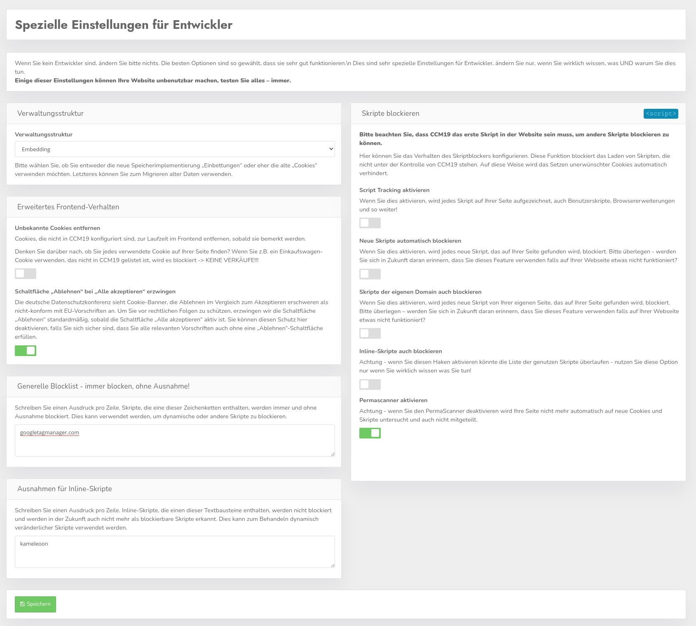

# Developer Einstellungen

Wenn Sie kein Entwickler sind, ändern Sie bitte nichts. Die besten Optionen sind so gewählt, dass sie sehr gut funktionieren. Dies sind sehr spezielle Einstellungen für Entwickler, ändern Sie nur, wenn Sie wirklich wissen, was UND warum Sie dies tun.
**Einige dieser Einstellungen können Ihre Website unbenutzbar machen, testen Sie alles - immer.**



## Verwaltungsstruktur umstellen

CCM19 ist standardmäßig so eingestellt dass Kunden / Besucher auf Ihrer Webseite die Skripte im Block mit den dazugehörigen Cookies zustimmen oder nicht. Als Beispiel dient hier Google Anayltics, der Nutzung kann man zustimmen oder nicht, aber nicht der Nutzung der einzelnen Cookies, das ist technisch schlicht nicht sinnvoll.

Die alte CCM19 Version erlaubte dies dennoch, das wurde aber schon vor langer Zeit umgestellt. Einige alte Versionen nutzen die veraltete Cookie Einstellung noch, daher bieten wir hier die Möglichkeit an das umzustellen.


## Unbekannte Cookies entfernen

CCM19 kann so konfiguriert werden, dass Cookies, die im Tool nicht hinterlegt sind, entfernt werden, sobald sie bemerkt werden.

Das funktioniert natürlich nur für First Party Cookies. Third Party Cookies die z.B. von iframes eingebunden werden können von der eigenen Seite technisch leider nicht angefasst und daher auch nicht gelöscht werden. Das verhindern die Sicherheitseinstellungen in Ihrem Browser - das ist so auch absolut richtig!

Daher muss man diese Skripte oder iframes blocken bevor sie ausgeführt werden - also auch bevor sie die Cookies setzen.

**Denken Sie darüber nach, ob Sie jedes verwendete Cookie auf Ihrer Seite finden? Wenn Sie z.B. ein Shopping Card Cookie verwenden, das nicht in CCM19 gelistet ist, wird es blockiert -> KEINE VERKÄUFE!!!** 

**Daher gilt hier TESTEN! TESTEN! TESTEN!**

## Schaltfläche „Ablehnen“ bei „Alle akzeptieren“ erzwingen

Die deutsche Datenschutzkonferenz sieht Cookie-Banner, die Ablehnen im Vergleich zum Akzeptieren erschweren als nicht-konform mit EU-Vorschriften an. Diese Einschätzung wird von vielen staatlichen Datenschutz Organisationen EU-weit geteilt. 

Um Sie vor rechtlichen Folgen zu schützen, erzwingen wir die Schaltfläche „Ablehnen“ standardmäßig, sobald die Schaltfläche „Alle akzeptieren“ aktiv ist. Sie können diesen Schutz hier deaktivieren, falls Sie sich sicher sind, dass Sie alle relevanten Vorschriften auch ohne eine „Ablehnen“-Schaltfläche erfüllen.


## Generelle Blocklist - immer blocken, ohne Ausnahme!

Wenn Sie hier etwas eintragen werden alle Skripte die diesen String enthalten immer und überall geblockt, ohne dass die Benutzer der Seite die Möglichkeit haben das jeweilige Skipt zu entblocken.

Schreiben Sie einen Ausdruck pro Zeile. Skripte, die eine dieser Zeichenketten enthalten, werden immer und ohne Ausnahme blockiert. Dies kann verwendet werden, um dynamische oder andere Skripte zu blockieren.

**Aber**

Das betrifft natürlich nur Skripte die auf der Seite enhalten sind, Skripte die z.B. über Embeddings hinzugefügt werden, betrifft das natürlich nicht.


## Skripte blockieren

Hier können Sie das Verhalten des Scriptblockers konfigurieren. Diese Funktion blockiert das Laden von Skripten, die nicht unter der Kontrolle von CCM19 stehen. Auf diese Weise wird das Setzen unerwünschter Cookies automatisch verhindert genauso wie das ausführen unbekannter Skripte.

### Neue Skripte automatisch blockieren

Wenn dieser Haken aktiviert ist werden von CCM19 neu gefundene Skripte direkt deaktiviert und geblockt. Seien Sie bitte vorsichtig bei diesem Haken, er kann auch notwendige Funktionen unterbinden die Sie evtl. nicht eingetragen haben als erwünscht. 

### Skripte der eigenen Domain auch blockieren

Ist dieser Haken gesetzt werden alle Skripte auch der eigenen Domain blockiert wenn sie neu gefunden werden. Beispiel:

``` html
<script type="text/javascript" src="/js/main.js" defer="defer"></script>
```

### Inline Skripte auch blockieren

Ist dieser Haken gesetzt werden auch Inline Skripte die als Schnipsel in Ihrer Seite eingebaut sind deaktiviert werden wenn Sie auf der Seite auftauchen - Beispiel:

``` javascript
<script type="application/javascript">
  window.onload = function()
   {
     window.localStorage.clear();
   }
</script>
```

## Ausnahmen für Inline-Skripte

Wenn im CCM19 das Scannen auch nach inline und eigenen Skripten aktiviert ist (nicht zu empfehlen da sehr ressourcenhungrig), können Sie dort Ausnahmen eintragen aufgrund spezielle Schnipsel nicht mehr beachtet werden sollen.


# Gefundene Skripte

Hier finden Sie eine Auflistung aller externen Skripte die der automatische Scanner des CCM19 Widgets auf Ihrer Seite findet.


## Auflistung der Skripte

Die Auflistung zeigt Ihnen welche Skripte auf Ihrer Seite zu finden sind, es wird dabei der gesamte Codeschnipsel angezeigt. Weiterhin zeigt ein Link wo das Skript zum ersten mal gefunden wurde, und ob es aktiv ist. 

Der rote Button löschen entfernt das Skript aus diesem Listing - es führt **nicht** dazu dass das Skript aus Ihrer Seite entfernt wird, dort bleibt es weiterhin erhalten und ausführbar.

## Skripte deaktivieren

Sie können die gefundenen Skripte hier manuell und global deaktivieren. Wenn Sie z.B. keine 100%ige Kontrolle über den Quellcode der Seite haben, wie es z.B. bei vielen Cloud Anbietern der Fall ist, haben Sie hier die Möglichkeit darauf zu zugreifen und Einbindungen zu unterbinden.

Um ein Skript zu deaktivieren, setzen Sie den Haken auf inaktiv. Damit wird es dann im Frontend solange geblockt wie das CCM19 Widget aktiv ist.

