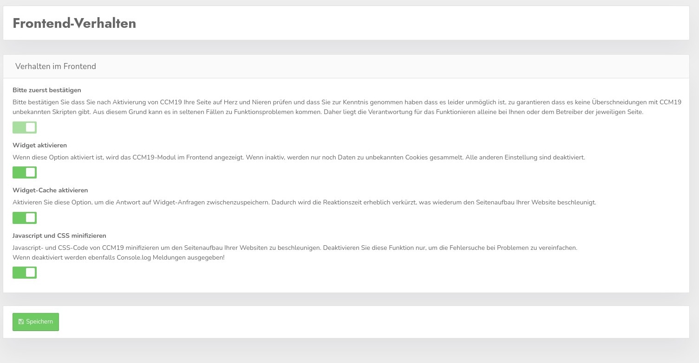

# Front end behavior

Here you can make a number of settings that affect the behavior in the frontend of the page that uses CCM19. The available settings are explained below.

&gt; Check your site after every activation or change if e.g. essential functions like shopping cart, payment functions and all other desired functions are still working**!!!!

## Please confirm first

**CCM19 is working very hard to cover all possible and impossible pitfalls** - with the sheer number of possible overlaps with other scripts or problems we unfortunately cannot guarantee that everything will work 100% after activation. Alone the combination possibilities of the scripts known to us with the respective setting possibilities goes into the billions.

By checking this box you confirm that you have taken note of this and that the responsibility for the functioning lies solely with you or the operator of the respective site.

After activation, the screen will look like this and you can now make all the settings.

## Activate widget

If this item is **disabled**, the CCM19 module will **not** be displayed in the frontend and the corresponding stored scripts will **not** be executed. Data about unknown cookies and scripts will continue to be collected even if the widget is disabled 

This function can be used to install CCM19 on the website, then test everything and only when you have entered all cookies and scripts correctly to activate CCM19.

## Activate Widget Cache

The widget cache is enabled by default and always runs for 24h. The cache contributes significantly to the performance, without cache the widget takes much longer to build. Depending on the server and load, this can be a significant difference.

Disable the hook only when you want to test something and do not forget to enable it again!

## Minify Javascript and CSS

Minify Javascript and CSS code from CCM19 to speed up the page load of your websites. Disable this feature only to simplify troubleshooting in case of problems.

