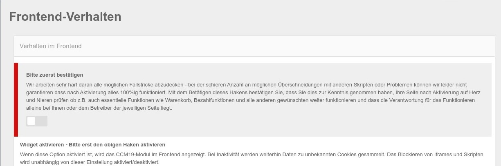
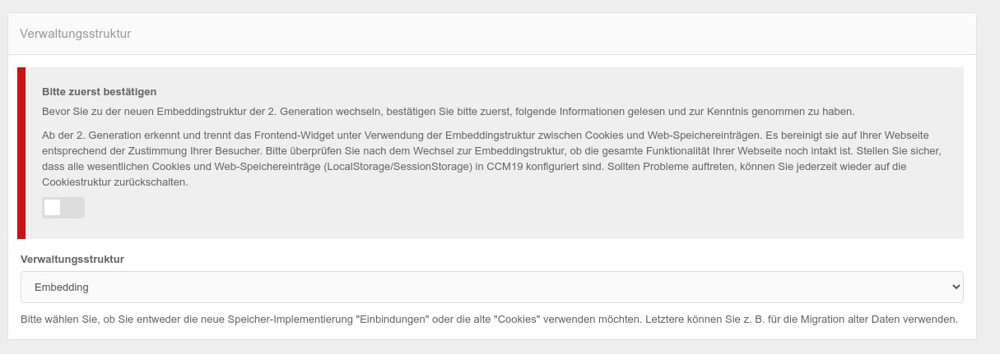

# Frontend Verhalten

Hier können Sie eine Reihe von Einstellungen treffen die das Verhalten im Frontend der Seite beeinflussen die CCM19 nutzen. Die verfügbaren Einstellungen werden im folgenden erläutert.

# Bitte zuerst bestätigen

CCM19 arbeitet sehr hart daran alle möglichen Fallstricke abzudecken - bei der schieren Anzahl an möglichen Überschneidungen mit anderen Skripten oder Problemen können wir leider nicht garantieren dass nach Aktivierung alles 100%ig funktioniert. Alleine die Kombinationsmöglichkeiten der uns bekannten Skripte mit den jeweiligen Einstellmöglichkeiten geht in die Milliarden.

Mit dem Betätigen dieses Hakens bestätigen Sie, dass Sie dies zur Kenntnis genommen haben und dass die Verantwortung für das Funktionieren alleine bei Ihnen oder dem Betreiber der jeweiligen Seite liegt.


> **Prüfen Sie Ihre Seite nach Aktivierung auf Herz und Nieren ob z.B. auch essentielle Funktionen wie Warenkorb, Bezahlfunktionen und alle anderen gewünschten weiter funktionieren**!!!





Nach der Aktivierung sieht die Maske folgendermaßen aus und Sie können nun alle Einstellungen treffen.


.jpg)


## Widget aktivieren

Ist dieser Punkt **deaktiviert**, wird das CCM19 Modul im Frontend **nicht** angezeigt und die entsprechend hinterlegten Scripte werden **nicht** ausgeführt. Daten zu unbekannten Cookies und Scripten werden auch bei deaktiviertem Widget weitergesammelt. 

Diese Funktion kann man nutzen um CCM19 auf der Webseite zu installieren, dann alles testen und erst wenn man alle Cookies und Skripte korrekt eingetragen hat CCM19 zu aktivieren.


## Unbekannte Cookies entfernen

CCM19 kann so konfiguriert werden, dass Cookies, die im Tool nicht hinterlegt sind, entfernt werden, sobald sie bemerkt werden.

Das funktioniert natürlich nur für First Party Cookies. Third Party Cookies die z.B. von iframes eingebunden werden können von der eigenen Seite technisch leider nicht angefasst und daher auch nicht gelöscht werden. Das verhindern die Sicherheitseinstellungen in Ihrem Browser - das ist so auch absolut richtig!

Daher muss man diese Skripte oder iframes blocken bevor sie ausgeführt werden - also auch bevor sie die Cookies setzen.


## Javascript und CSS minifizieren

Javascript- und CSS-Code von CCM19 minifizieren um den Seitenaufbau Ihrer Websiten zu beschleunigen. Deaktivieren Sie diese Funktion nur, um die Fehlersuche bei Problemen zu vereinfachen.


## Verwaltungsstruktur umstellen

Durch neuere rechtliche Vorgaben hat sich eine andere Struktur der Darstellung im Frontend ergeben. Diese Darstellung orientiert sich an den Skripten oder auch Einbindungen die jeweils 1 - x Cookies setzen, Local Storage Elemente und weiter Punkte setzen.

Um den Umstieg zu erleichtern kann man jederzeit zwischen den verschiedenen Bereichen umstellen. Je nach Einstellung stellen sich sowohl die Cookie Masken als auch die Frontend Widgets anders da. Die aktuelle Dokumentation beschreibt nur die neue Variante da nur diese weiter entwickelt wird.




Sie können hier zwischen Embedding (neu) und Cookie (veraltet) wählen. Allerdings müssen Sie die Umstellung erst bestätigen.

> Ab der 2. Generation erkennt und trennt das Frontend-Widget unter Verwendung der Embeddingstruktur zwischen Cookies und Web-Speichereinträgen. Es bereinigt sie auf Ihrer Webseite entsprechend der Zustimmung Ihrer Besucher. Bitte überprüfen Sie nach dem Wechsel zur Embeddingstruktur, ob die gesamte Funktionalität Ihrer Webseite noch intakt ist. Stellen Sie sicher, dass alle wesentlichen Cookies und Web-Speichereinträge (LocalStorage/SessionStorage) in CCM19 konfiguriert sind. Sollten Probleme auftreten, können Sie jederzeit wieder auf die Cookiestruktur zurückschalten.


>  Falls Sie noch kein CCM19 im Einsatz haben ist diese Umstellung für Sie nicht relevant - diese betrifft nur Bestandskunden.


## Skripte blockieren

Hier können Sie das Verhalten des Scriptblockers (Menüpunkt [Skripte](skripte.md) ) konfigurieren. Diese Funktion blockiert das Laden von Skripten, die nicht unter der Kontrolle von CCM19 stehen. Auf diese Weise wird das Setzen unerwünschter Cookies automatisch verhindert genauso wie das ausführen unbekannter Skripte.


### Neue Skripte automatisch blockieren

Wenn dieser Haken aktiviert ist werden von CCM19 neu gefundene Skripte direkt deaktiviert und geblockt. Seien Sie bitte vorsichtig bei diesem Haken, er kann auch notwendige Funktionen unterbinden die Sie evtl. nicht eingetragen haben als erwünscht. 

### Skripte der eigenen Domain auch blockieren

Ist dieser Haken gesetzt werden alle Skripte auch der eigenen Domain blockiert wenn sie neu gefunden werden. Beispiel:

``` javascript
<script type="text/javascript" src="/papoo_git_full/js/main.js" defer="defer"></script>
```

### Inline Skripte auch blockieren

Ist dieser Haken gesetzt werden auch Inline Skripte die als Schnipsel in Ihrer Seite eingebaut sind deaktiviert werden wenn Sie auf der Seite auftauchen - Beispiel:

``` javascript
<script type="application/javascript">
  window.onload = function()
   {
     window.localStorage.clear();
   }
</script>
```


## IFrames blockieren

Verwenden Sie diese Funktion, um zu verhindern, dass externe Ressourcen geladen werden, die über einen Iframe-Container eingebettet sind. Auf diese Weise wird das Setzen unerwünschter Cookies automatisch verhindert. Der Benutzer kann mit dem stattdessen angezeigten Dialog dem Laden des Inhalts zustimmen.


### Iframe Blockierung aktivieren

Mit dem Haken aktivieren Sie die Blockierung der IFrames - vermutlich offensichtlich...

## Einwilligung pro Domain merken

Ist dieser Haken gesetzt merkt sich CCM19 für welche iframes von welcher Seite bereits ein Consent gesetzt wurde. Wenn z.B. einmal ein Youtube Video per Consent bestätigt wurde, werden alle weiteren Youtube Videos ohne Consent eingeblendet, da der Benutzer der Nutzung ja schon einmal zugestimmt hat. 

> Ob das DSGVO konform ist kann man derzeit nicht sagen, wir schätzen das derzeit positiv ein, allerdings bleibt die Entscheidung natürlich bei Ihnen.

### Iframe Ausnahmen

Hier gibt es verschiedene Varianten, wenn Sie hier nichts einstellen wird standardmäßig alles immer blockiert.

### Whitelist Modus

Wenn Sie diese Auswahl treffen werden alle Iframes blockiert die nicht in der Filterliste drin stehen. Tragen Sie dort z.B. youtube ein, wird nur das iframe von Youtube nicht geblockt, wohl aber alle anderen. (Dieses Vorgehen empfehlen wir jedoch gerade für Youtube nicht!) 

### Blacklist Modus

In dieser Variante werden keine iframes blockiert, es sei denn sie stehen hier in der Liste. Tragen Sie dort nun youtube ein, werden nur die Iframes von Youtube blockiert, nicht aber alle anderen.

## Filter

Schreiben Sie einen Ausdruck pro Zeile. 

### Vorschaubilder

Bei Einbettungen von den großen Videoportalen wie Youtube oder Vimeo werden Screenshots der Videos als Sperrbild auf der Seite ausgegeben, so dass besser ersichtlich ist was genau im Video passiert. Es wird dabei der von den Portalen bereit gestellte Shot genommem.

Die Bilder werden auf der Seite gechached damit sie nicht bei jedem Seitenaufruf neu abgerufen werden müssen. Der Cache läuft nach 8 Tagen aus. Wollen Sie den Cache früher leeren, klicken Sie einfach auf den Button "Vorschaubild-Cache leeren".