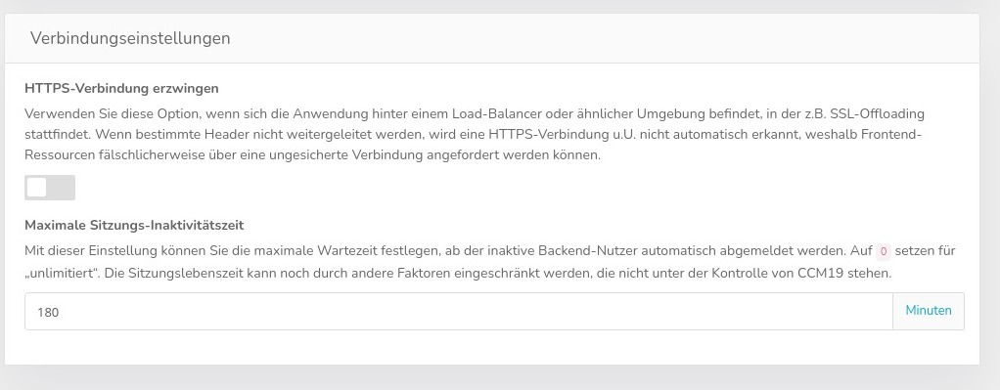

# Network / Proxy settings

These special settings are used only very rarely. CCM19 is built in such a way that it usually gets along with the normal settings of the providers without any problems.

## Force HTTPS connection

Use this option if the application is behind a load balancer or similar environment where, for example, SSL offloading takes place. If certain headers are not forwarded, an HTTPS connection may not be automatically detected, and therefore frontend resources may be incorrectly requested over an unsecured connection 

So if you have problems with SSL functions, this is your first port of call.

## Maximum session inactivity time

With this setting you can define the maximum waiting time after which inactive backend users are automatically logged out. Set to '0' for unlimited. The session lifetime can still be limited by other factors that are not under the control of CCM19.

## Proxy settings

Use this option **only** if connections from this server must be routed through a proprietary proxy. Use `*server*:*port*` or `http://*server*:*port*` for HTTP proxies, `https://*server*:*port*` for HTTPS, `socks4://*server*:*port*` for SOCKS 4 and `socks5://*server*:*port*` for SOCKS 5 proxies.

## Call counter exceptions

Here you can exclude IP addresses and `user agent` strings from the call count. This can be used to prevent search engine bots and local users from increasing the call counter and thus being counted at rate limits.

This function is set globally for all users in the cloud version.

