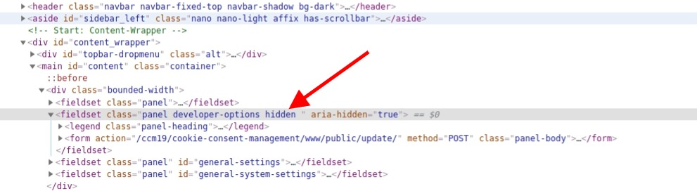

# Updates

Durch die Update-Funktion bekommen Sie immer die aktuellste und neuste stabel-Version des CCM19 Tools. Im Changelog können Sie sehen, was für Änderungen vorgenommen wurden. 

## Automatische Updates

Durch das aktivieren der Funktion "Automatische Updates aktivieren" wird Ihr CCM19 System automatisch aktualisiert. 

## Beta Version

Sie haben die Möglichkeit - absolut auf eigene Verantwortung und **ohne** Support am Beta Kanal teilzunehmen. Gehen Sie dafür in den Quelltext der Seite mit den Entwicklertools.

Entfernen Sie an der angezeigten Stelle den Eintrag "hidden" - sobald Sie das gemacht haben taucht folgender Eintrag auf.

Wählen Sie hier aus dem Selectfeld "Beta" aus und drücken sie auf speichern. Sie sind ab jetzt im Beta Channel für die Verteilung von Updates und Upgrades.