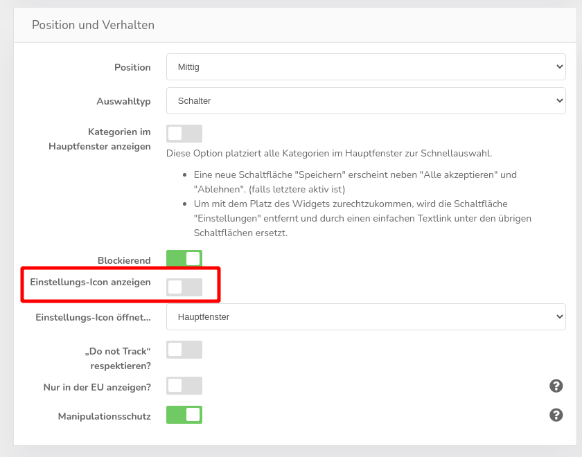
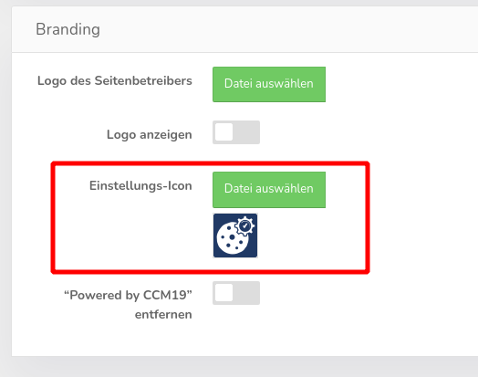

# Das Einstellungsicon unten links stört mich, kann ich das ändern/entfernen?

Das sogenannte Einstellungsicon ist in unseren Designvorlagen standardmäßig aktiviert, kann aber leicht abgeschaltet werden. Gehen Sie dazu in die Theme-Verwaltung und deaktivieren die entsprechende Funktion beim genutzten Theme:

Weiter unten auf der Seite können Sie das Icon auch gegen ein eigenes austauschen:

