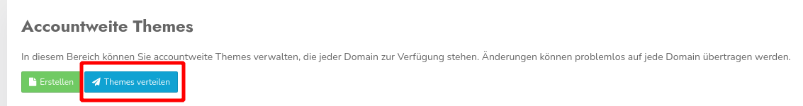

# **Meine Änderungen am Theme werden auf meiner Seite nicht angezeigt**

Sie haben Änderungen am Theme vorgenommen, die in der Vorschau, aber nicht auf Ihrer Webseite angezeigt werden? Das sind die häufigsten Gründe:

1\. Auf dem Dashboard kann ein Theme fest in den Code des CCM19 geschrieben werden, das dann immer verwendet wird. Wenn Sie beispielsweise ein Theme kopiert und die Kopie anschließend zum aktiven Theme machen, wird weiterhin das Theme verwendet, das im Code-Snippet angegeben ist. Entfernen Sie einfach die Theme-Information aus dem Code-Snippet, damit wirklich das derzeit aktive Theme ausgegeben wird.

2\. Sie haben ein accountweites Theme bearbeitet und möchten das Ergebnis auf einer Seite sehen, die auf dieses Theme zugreift. Damit Änderungen am Theme in allen zugeordneten Accounts zur Verfügung stehen, muss das Theme nach dem Speichern erst verteilt werden. Die Option finden Sie direkt über der Liste mit den accountweiten Themes:

