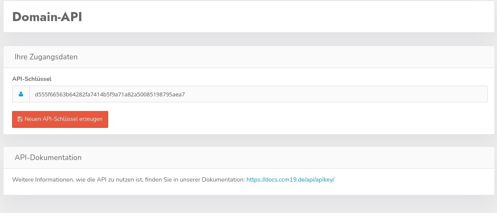

# Domain API

The DomainAPI provides an interface with which data can be read out per domain.

Here you can set or read the API key.

The complete documentation of the interface can be found here. [General API documentation](/api/general_api/)

