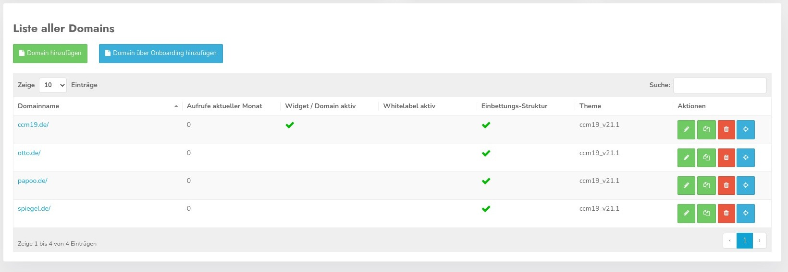
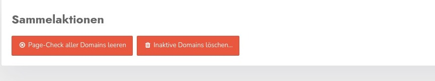

# Domain management

You can reach the domain administration by clicking on your name in the upper right corner and then on the item "Domain administration". In the domain administration you can create, edit and delete your domains as well as activate or deactivate the whitelabel function 

You can also see an overview of how many calls are available to you and how many calls have already been used up. Also the number of domains and the number of whitelabel licenses.

In the area next to it, your current tariff is displayed - here the Free tariff. By clicking on the button "To the tariff overview" you can book a tariff directly from there. You can also activate the sliding tariffs, but you must have booked at least a Starter tariff.

## Overview of calls &amp; Co.

You can see here how many domains you are already using from the available ones, how many whitelabel licenses you are using and how many Cookie Manager calls have already been made this month.

The data for the calls are reset every month on 01.

## Create and edit domains

In the list you can see all domains you are currently managing. A click on the name of the domain or on the blue button at the very end with the star will lead you to the administration of just this domain.

The table also shows whether the domain is active - i.e. in use, or not. It also shows if the domain is used as a whitelabel, how many views have been used this month and which theme is currently used.

With the **blue button** you jump into the administration of the domain and 

### Edit entry

With a click on the green symbol you get back to the settings mask where you can change the data for the domain again.

### Copy domain entry

With the **Copy icon** you can copy an entry completely with all settings.

### Delete domain entry

Use the red button to delete the domain entry completely - after previous query.

## Collection actions

You have to be careful with the two buttons. The first one deletes all PageCheck entries all domains, so everything you found in Pagecheck. PageCheck checks your domains regularly for new cookies and other entries.

The 2nd button deletes all inactive domains. These are then irretrievably lost. A backup is not done at this point, so you better be sure what you are doing :-).
