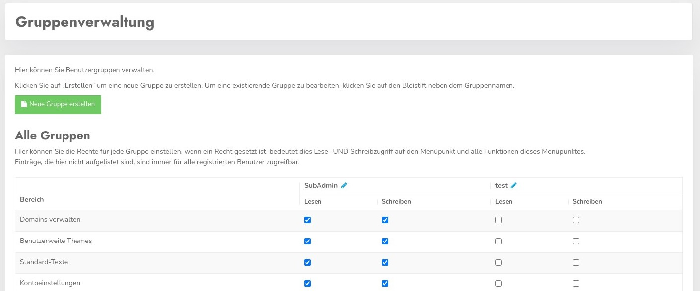
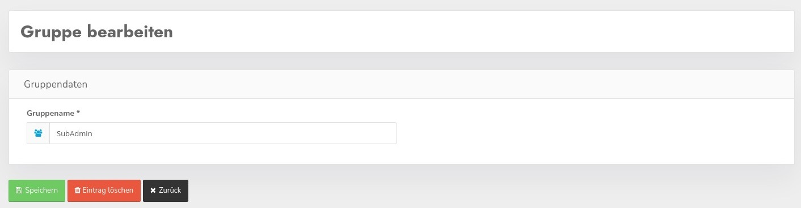

# Group management

Access rights to all areas within the CCM19 area can be defined via the groups.

You can define for each group which menu item in your area users of this group have read and/or write access to.

To do this, simply check the boxes and click Save under the table, the rights are then automatically transferred to the associated users.

## Create / edit group names

You can edit the name of each group and change it at any time.

