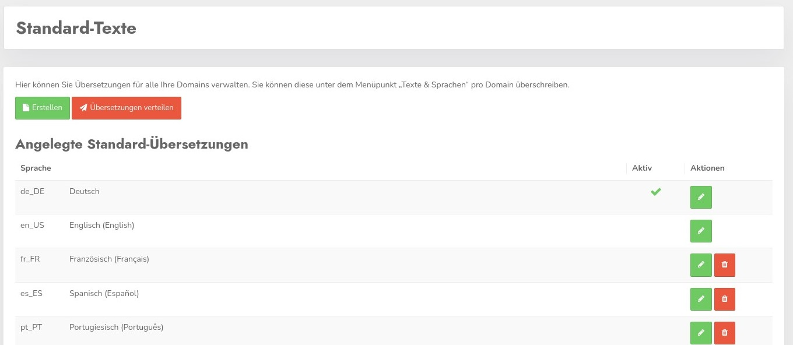

# Standard texts

You can set the cross-domain standard texts here. These texts include all content that is not dependent on cookies or other dynamic elements.

This is e.g. the main text on the welcome banner, or the label of the buttons. The whole of course always in all available languages - min. 24

With Create you can create data for another language, but usually you will want to edit the data of existing languages.

Similar to the themes, the changed data can be distributed to all used domains in one go with the **Distribute translations** button 

Clicking on the pencil takes you to the editing screen.

### Edit entries

Here you can then edit the entries accordingly. The check mark "Activate translation" activates the language for use with modified texts. If the check mark is not set, the standard texts of this language will continue to be used.

