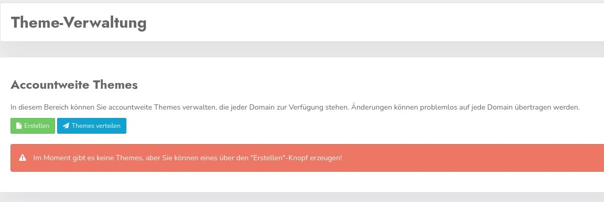

# Theme management

The account theme management provides you with a cross-domain possibility to prepare themes for all domains as templates or to change them for all of them at the same time.

However, it only makes sense to use it if you want to create and manage your own themes. Per domain in all accounts a number of contemporary templates are available that you can customize at any time.

## Theme management

Here you see the mask for the administration of the themes. By default there are none predefined because there are already plenty of templates for each domain.

### Create theme

Clicking the button leads to the following mask.

.jpg)

Here you can set all relevant settings regarding the themes. The details of the individual areas are explained in the Theme section in the Cookie &amp; Co, Administration.

### Distribute themes

Clicking this button will distribute the theme or changes in existing themes to all domains 

**Please note that these changes will be live immediately