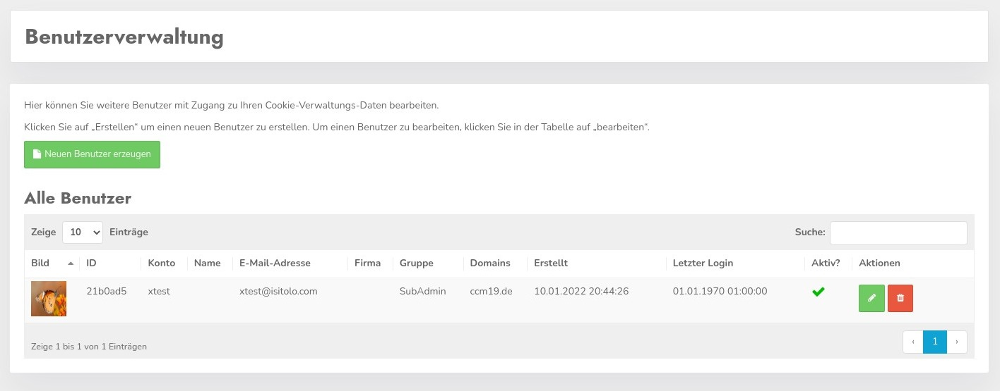

# Userverwaltung

In jedem Account können Unterbenutzer und Untergruppen erstellt und verwaltet werden. Sie können User erstellen und bearbeiten die nur auf Ihren Account Zugriff haben **und** z.B. nur auf eine Domain.

 In der Übersicht erkennt man die Namen und Daten der jeweiligen User, letzter Login, wann erstellt usw. 

Der grüne Edit Button führt zur Bearbeitungsmaske des jeweiligen Benutzers, mit dem roten Löschen Button kann der Account entfernt werden.

