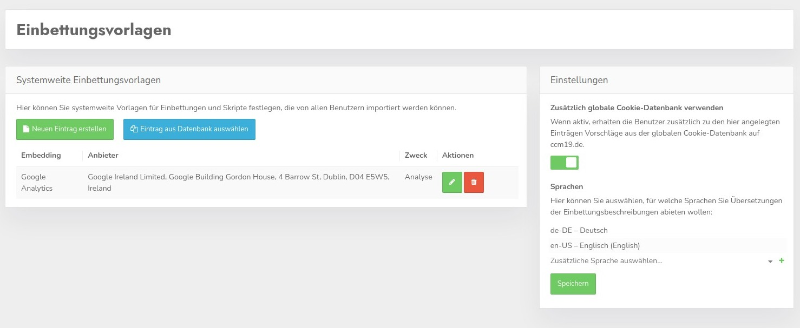
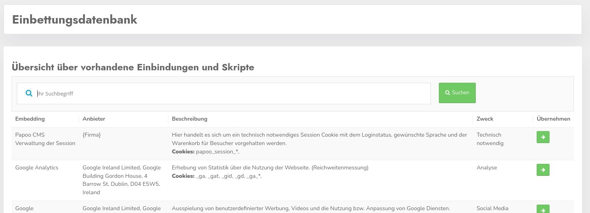
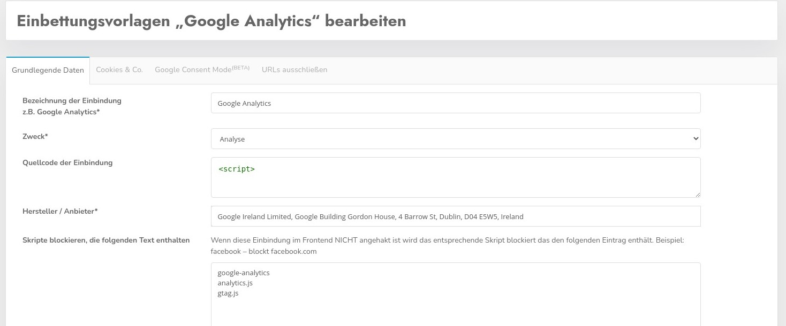

# Einbettungsvorlagen

Die Einbettungsvorlagen sind nichts anderes als eine eigene Datenbank für Cookies / Skripte usw. Sie können hier Daten einstellen und pflegen zusätzlich zu den Daten die aus der CCM19 Datenbank kommen.

Hier können Sie auch eigene Einträge erstellen die nur Ihren Kunden oder in Ihrem Unternehmen zur Verfügung stehen, oder bestehende Einträge aus der CCM19 Datenbank übernehmen und ergänzen.

## Einstellungen

Wenn Sie den Haken hier setzen wird Ihren Kunden / Mandanten zusätzlich die CCM19 Datenbank der Cookies / Embeddings für die Nutzung angeboten. Das ist auch der empfohlene Grundzustand.

Zusätzlich können Sie hier auch festlegen für welche **Sprachen** Sie diese Vorlagen bereit stellen wollen.

## Eintrag erstellen / bearbeiten

Sie können einen neuen Eintrag einfach aus der CCM19 Datenbank übernehmen, klicken Sie dafür auf den blauen Button.

Hieraus können Sie dann einen Eintrag direkt übernehmen, er steht dann in Ihrer Datenbank zur Verfügung und Sie können den Eintrag dort bearbeiten.

Die Bearbeitung erfolgt genauso wie im Bereich [Cookies & Einbindungen](/funktionen/cookies-und-andere/) beschrieben.

### Automatische Aktualisierung

Diese Funktion wird grundlegend im Bereich [Cookies & Einbindungen](https://docs.ccm19.de/funktionen/cookies-und-andere/#automatische-aktualisierung) erklärt. Da man als Agentur ebenfalls eigene Vorlagen pflegen kann, wird für Agenturkunden doppelt geprüft. Zum einen, ob es Änderungen in den Vorlagen der Agenturversion gibt, und zum anderen, ob es Änderungen in unserer Datenbank gibt. Bei einer Verkettung (Datenbank → Vorlage →Embedding) kann es bis zu 48 Stunden dauern, bis Änderungen sichtbar sind.
