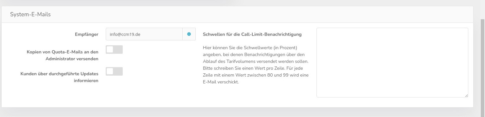
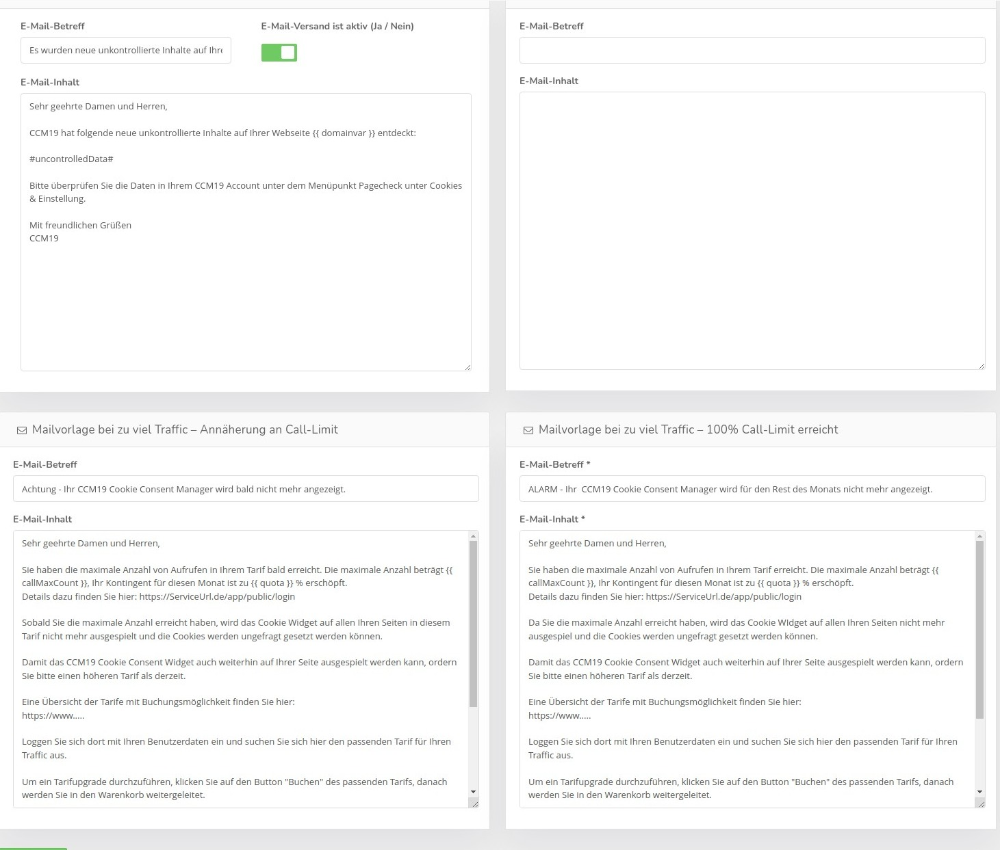

# E-Mail

Der E-Mail Bereich für die Agency Version ist erweitert im Vergleich zur Downloadversion. Die grundsätzlichen Einstellungen sind aber identisch und sind hier zu finden: [Standard Mail Einstellungen](../system-und-co/email.md) 

## Quota Mails

Wenn Sie ein Quota für die Zugriffszahlen nutzen, gehen automatisch bei Annährung an das Quota Mails an die Kunden raus die darauf hinweisen. Sie können einstellen dass der Admin oder eine andere E-Mail Adresse eine Kopie der Quota Mails bekommt.

Zusätzlich können Sie einstellen ob eine Kopie der Quota Mails an den Admin rausgehen und ob Kunden über durchgeführte Updates per E-Mail informiert werden.

Falls Sie Call Limits nutzen, können Sie hier die prozentualen Schwellenwerte eintragen ab denen die jeweiligen Mails rausgehen die die Kunden / Mandanten darauf hinweisen dass demnächst der maximale Call Count erreicht wird.

## Quota Mails Vorlagen resp. Inhalt

Die Quota Mails selber können Sie hier vorbelegen. Dabei stehen folgende Variablen zur Verfügung. Die Synthax muss dabei beachtet werden - die geschweiften Klammern sind obligatorisch {{ varname }}.

| Variablen          | Inhalt                                                       | Benutzen in                     |
| ------------------ | ------------------------------------------------------------ | ------------------------------- |
| {{ callMaxCount }} | Die Anzahl der verfügbaren Aufrufe im jeweils  gewählten Tarif | Mail für die gefundenen Cookies |
| {{ quota }}        | Der numerische Wert des prozentualen Verbrauchs -  d.h. wenn 94% verbraucht sind enthält die Variable den Wert 94 | In der Mail "Call Limit"        |
| {{ username }}     | Benutzername des Kunden                                      | In der Mail "Call Limit"        |
| {{ email }}        | E-Mail Adresse des Kunden                                    | In der Mail "Call Limit"        |
| {{ domainvar }}    | Der Name der Domain für die die Mail versendet wurde         | Alle E-Mail Templates           |

## Mail Templates

Die Variablen können im Fließtext der Mails verwendet werden.

