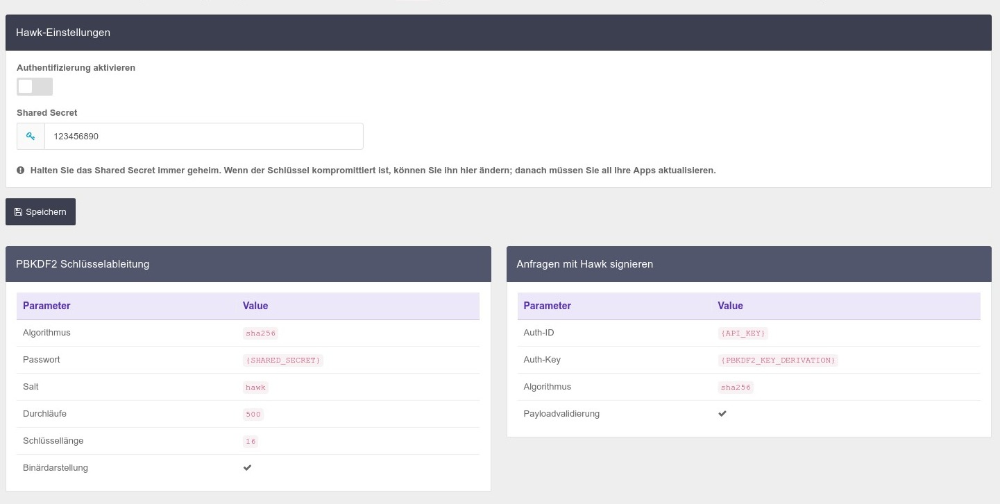

# Einstellungen

Die folgenden Informationen zur Hosting-API finden Sie ebenfalls im Admin-Bereich von CCM19. Diese API ermöglicht den Headless-Zugriff auf Funktionen für folgender Ressourcen:

* [Kunden](./endpoints/client.md)
* [Domains](./endpoints/domain.md)
* [Locales](./endpoints/locale.md) (Übersetzungen)
* [Themes](./endpoints/theme.md)
* [Platzhalter](./endpoints/placeholder.md)
* [Einbindungen](./endpoints/embedding.md) & [Cookies](./endpoints/embedding-asset.md)
* [Onboarding](./endpoints/onboarding.md)

Natürlich können alle diese Aktionen nur durchgeführt werden, wenn eine entsprechende Autorisierung vorliegt.

## Verbindung zur API herstellen

Um eine API-Anfrage erfolgreich zu verarbeiten, hängen Sie den API-Schlüssel an **jede Anfrage** an, indem Sie den GET-Parameter `apiKey` hinzufügen und den Schlüssel als Wert festlegen.

Setzen Sie für jede POST- und PUT-Anfrage den HTTP-Header `Content-Type` auf `application/json`; d.h. für jede Anfrage, die einen Nachrichtenkörper enthält. Kodieren Sie den zu sendenden Payload entsprechend.

Die echten API Schlüssel sind natürlich wesentlich komplexer. 😉

> **Halten Sie Ihren API-Schlüssel immer geheim. Wenn der Schlüssel kompromittiert ist, können Sie ihn hier ändern; danach müssen Sie all Ihre Apps aktualisieren.**

## Hawk HTTP-Authentifizierung verwenden

Wenn Sie diese Option aktivieren, kann eine signierte Anfrage verifiziert werden. Die Clientseite für diese Authentifizierungsmethode müssen sie jedoch selbst implementieren und in Ihre Anwendungen integrieren.

Verwenden Sie das Shared Secret, um Ihre Anfragen zu signieren. Dazu müssen Sie mithilfe des `PBKDF2`-Algorithmus einen Schlüssel aus dem Shared Secret ableiten. 

## Hawk HTTP-Authentifizierung verwenden

Wenn Sie diese Option aktivieren, kann eine signierte Anfrage verifiziert werden. Die Clientseite für diese Authentifizierungsmethode müssen sie jedoch selbst implementieren und in Ihre Anwendungen integrieren.

Verwenden Sie das Shared Secret, um Ihre Anfragen zu signieren. Dazu müssen Sie mithilfe des `PBKDF2`-Algorithmus einen Schlüssel aus dem Shared Secret ableiten. 

> Diese Funktion ist optional. Verwenden Sie diese Option, um eine teilweise kryptografische Verifizierung Ihrer Anfragen zu ermöglichen.

Sehen Sie sich folgende Ressourcen an, um Ihre Anfragen korrekt zu signieren.

- [Hawk — A PHP Implementation](https://github.com/dflydev/dflydev-hawk#building-a-client)
- [hash_pbkdf2 — Generate a PBKDF2 key derivation of a supplied password](https://www.php.net/manual/en/function.hash-pbkdf2.php)

