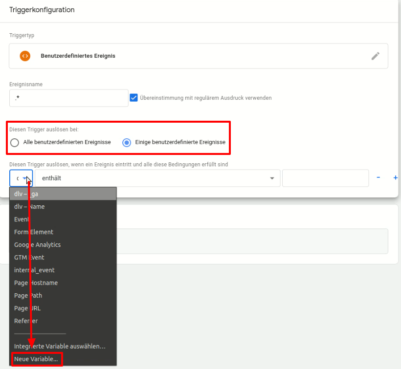

# Google Tag Manager

Da der Tag Manager als Container fungiert, über den Skripte in die Webseite eingebunden werden können, tauchen die Skripte nicht direkt im Quellcode auf. Entsprechend ist es nie möglich, die Skripte aus der Seite zu entfernen und beim Cookie neu einzubinden.

Um Skripte, die über den Tag Manager geladen werden, zu blocken, wird idealerweise ausschließlich das Feature "Embeddings blockieren, die folgenden Text enthalten" verwendet. Damit das Blocken der Skripte funktioniert, muss aber sichergestellt werden, dass der CCM19-Code im Quelltext vor dem Tag-Manager-Code steht.

Vorab möchten wir ausdrücklich darauf hinweisen, dass wir die Nutzung des Google Tag Managers nicht empfehlen, weil in den meisten Fällen ein Cookie gesetzt werden muss damit es funktioniert was technisch nicht wirklich notwendig ist, aber als solches definiert werden muss.

Außerdem ist unter dem Gesichtspunkt des Schrems II Urteils in Hinsicht Privacy Shield die ungefragte Einbindung von Google Services zumindest fraglich und sollte gut überlegt sein.

Um die Funktionalität des Tag Managers und auch von allen damit verbunden Diensten gewährleisten zu können, muss der Tag Manager immer aktiv sein. Somit sendet er zumindest immer die IP-Adresse des Nutzers an den Server des Tag Managers und damit auch an Google.

CCM19 stellt für die Kernfunktion des Google Tag Managers, Skripte auf der Website zu implementieren ohne den Quelltext bearbeiten zu müssen, eine Alternative dar.

Falls dies für Sie dennoch keine Option ist, folgen Sie bitte dieser Anleitung:

## Integration in Google Tag Manager

Über die Schnittstelle `window.dataLayer` werden Events im Google Tag Manager ausgelöst, falls dieser auf der Zielseite eingebunden ist.

Sobald ein Embedding über die CCM19-Oberfläche zugelassen wird, wird folgendes Event ausgelöst. Die Events werden bei jedem Seitenaufruf für alle zugelassenen Embeddings wiederholt abgefeuert.

```javascript
window.dataLayer.push({
    event: 'CCM19.embeddingAccepted', // Konstanter Bezeichner
    id: 'xxxxxxx', // CCM19-interne Embedding-ID
    name: 'Google Analytics', // Benutzerdefinierter Embedding-Name
});
```

Im Tag Manager kann über Triggers → New → Custom Events darauf reagiert werden.

.png)

So sehen die Informationen aus, die der Data Layer beinhaltet. Unser Ziel ist die Trigger auf diese Informationen festzulegen.

Unser Ausgangspunkt beginnt nach der erfolgreichen Implementierung von CCM19 und des Tag Managers auf Ihrer Website.

### 1. Der Eintrag in CCM19 für den Google Tag Manager

Navigieren Sie in CCM19 vom Dashboard & Einbindungen zu den Einbindungen & Cookies. Erstellen Sie dort einen Eintrag für den Google Tag Manager. Wie Sie einen Eintrag erstellen und worauf Sie achten müssen, finden Sie [hier](https://docs.ccm19.de/funktionen/cookies-und-andere/). Achten Sie darauf den Tag Manager als **technisch notwendig** einzustellen.

### 2. Tag einrichten

Für unser Beispiel erstellten wir ein Tag für das Webanalysetool Google Analytics. Den Tracking-Typ haben wir auf Seitenaufruf stehen lassen.

.png)

### 3. Trigger auswählen

Als Triggertyp [a)] stellen wir ein benutzerdefiniertes Ereignis ein und benennen es *.\** [b)]. Haken Sie die Option *Übereinstimmung mit regulärem Ausdruck verwenden* an [c)].

.png)

### 4.Variablen erstellen

Da das Ereignis für jedes Embedding gleich ist, wollen wir nun noch mit Variablen definieren, dass das Tag nur bei einer Einwilligung des Google Analytics Embedding gefeuert wird.
Wir klicken also auf *Diesen Trigger auslösen bei: Einige benutzerdefinierte Ereignisse* und fügen eine neue Variable ein.




Als Variablentyp wählen wir die Datenschichtvariable aus [a)]. Als Namen tragen wir den Key *name* ein [b)] und stellen auf Version 1 um [c)].

.png)

### 5. Variablenfilter hinzufügen

Nun definieren wir, welcher Wert der Key *name* haben muss, um den Trigger auszulösen. Hier tragen wir **immer** den Namen des Embeddings ein (so wie er in CCM19 hinterlegt wurde), also in diesem Fall *Google Analytics* [a)].

Außerdem fügen wir noch ein Event hinzu [b)].


.png)

Das Event, welches wir hier eintragen lautet *CCM19.embeddingAccepted*..png)

### 6. Testen, testen, testen…

Der Tag Manager bietet einen Vorschaumodus zum testen an. Bevor man also die Version live schaltet, sollte man überprüfen, ob die Tags auch gefeuert werden.
In den Nachrichten schauen Sie nach dem entsprechendem Embedding und sehen sich das Tag genauer an. Wenn dort alle Häkchen gesetzt worden sind, funktioniert das Tracking.

.jpg)

# Weitere Events

### CCM19.consentStateChanged

> nach Version 2020.11.26

Dieses Event wird jedes Mal ausgelöst, wenn der Seitenbesucher die Consent-Konfiguration abspeichert. Nachdem die initiale Zustimmung erfolgt, wird wird es zudem bei darauffolgenden Seitenaufrufen gesendet.

Es gibt Auskunft über die Berechtigungen, die der Seitenbesucher zuletzt konfiguriert hat.

Beispiel:

```javascript
window.dataLayer.push({
    event: 'CCM19.consentStateChanged',
    initialConsent: true,
    'ccm19_Google Ads Conversion': true,
    'ccm19_Facebook Pixel': true,
    'ccm19_YouTube Webplayer': true,
});
```

- **event**: *string* — Event-Bezeichner
- **initialConsent**: *boolean* — Bei initialer Konfiguration des Seitenbesuchers `true`, andernfalls `false`.
- **ccm19_{EMBEDDING_NAME}**: *boolean* — Sofern Embedding durch Seitenbesucher zugestimmt, `true`, andernfalls `false`.

### CCM19.embeddingAccepted

Dieses Event wird bei jedem Seitenaufruf und Bestätigen des Consent-Dialogs für jedes Embedding abgefeuert, dem der Seitenbesucher durch seine letzte Konfiguration zugestimmt hat.

Beispiel:

```javascript
window.dataLayer.push({
    event: 'CCM19.embeddingAccepted',
    id: 'xxxxxxx',
    name: 'CMS Session',
});
```

- **event**: *string* — Event-Bezeichner
- **id**: *string* — CCM19-interne Embedding-ID
- **name**: *string* — Benutzerdefinierter Embedding-Name

## Cookiebasiert (veraltet)

> **Veraltet:** Bitte nicht für neue Projekte verwenden; alten Code auf Embedding-Events umstellen.

Über den DataLayer wird im Google Tag Manager für jedes Cookie, das erlaubt wird, ein „Custom Event" ausgelöst:

```
CCM19.cookieAccepted.<cookiename>
```

Also z.B. `CCM19.cookieAccepted._ga` für das Cookie **_ga**.