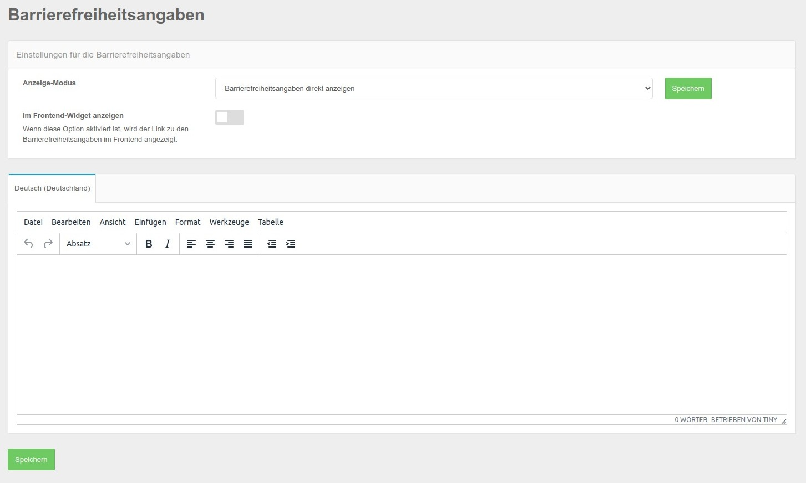
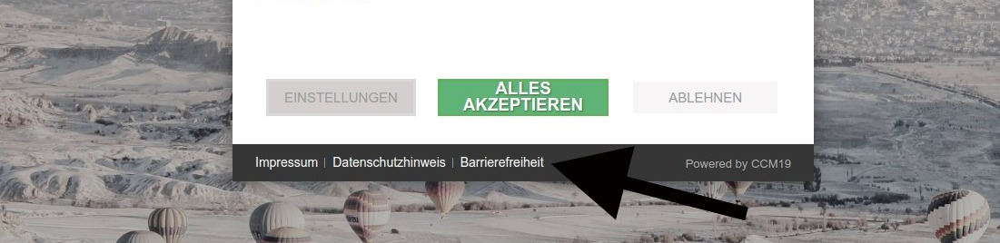

# Barrierefreiheit

Unter dem Punkt Barrierefreiheit können Sie optional auch einen Link zum Thema Barrierefreiheit einbinden der wieder ein eigenes Fenster öffnet.

## Barrierefreiheit bearbeiten

Die Daten zur Barriefreiheie können Sie in der Administration direkt eintragen und bearbeiten, auf dem folgenden Screenshot sehen Sie die Bearbeitungsmaske. Zusätzlich zu den Optionen im Impressum und Datenschutzerklärung können Sie hier optional bestimmen ob der Link auch in der Maske erscheinen soll. Setzen Sie dafür bitte den Haken bei **"In Frontend-Widget anzeigen"**

## Barrierefreiheitserklärung im Frontend

Um Ihren Anforderungen genüge zu tun bindet CCM19 die Möglichkeit ein die Barrierefreiheiterklärung entweder direkt im Widget erreichbar zu machen, wie auf dem Screenshot zu sehen oder zu verlinken.

Der Link öffnet dann eine Maske wo die Barrierefreiheiterklärung der Seite ausgeben wird.

## Barrierefreiheitserklärung als Link

Sie haben die Möglichkeit den Link zur Barrierefreiheitserklärung direkt zu setzen, dazu müssen Sie in der folgenden Maske die Einstellung folgendermaßen setzen: "Barrierefreiheitserklärung als Link".

Dann können Sie den Link zum Barrierefreiheitserklärung direkt eingeben und er wird auch so im Frontend genutzt.