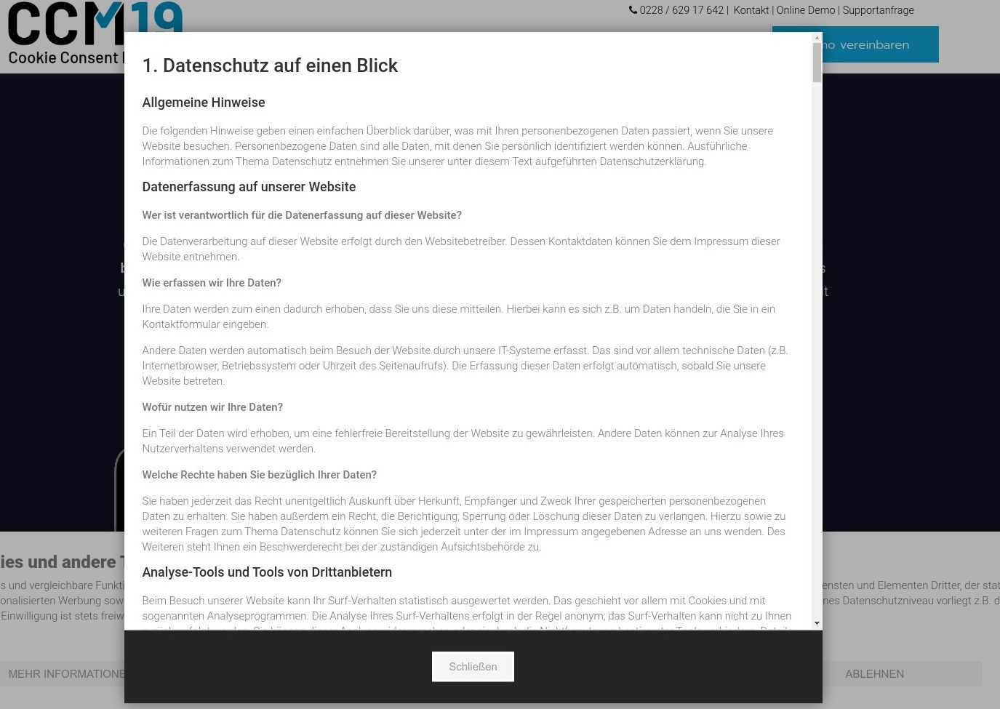

# Datenschutzerklärung

Laut DSGVO müssen die Datenschutzerklärung einer Seite - ebenso wie das Impressum - noch vor einem Consent vom Benutzer lesbar sein. Der Besucher darf nicht gezwungen werden einen Consent zu machen bevor er diese Daten nicht gesehen hat.

## Datenschutzerklärung als Link - Standard

Sie haben die Möglichkeit den Link zur Datenschutzerklärung direkt zu setzen, dazu müssen Sie in der folgenden Maske die Einstellung folgendermaßen setzen: "Datenschutzerklärung als Link".

Dann können Sie den Link zum Datenschutzerklärung direkt eingeben und er wird auch so im Frontend genutzt.

### Zeige das Widget auf der unten angegebenen Seite an

Wenn Sie dieses Häkchen setzen wird das Widget auch auf der Datenschutzhinweisseite angezeigt. Dies ist allerdings in den meisten Fällen nicht sinnvoll, da laut DSGVO der Zugang zu der Seite Datenschutzhinweis auch ohne Banner möglich sein muss.

Daher ist der Haken standardmäßig nicht gesezt **und** Sie sollten gut überlegen ob das auch wirklich so genutzt werden soll falls Sie den Haken aktivieren wollen.

### In einem neuen Tab öffnen

Ist der Haken gesetzt öffnen sich die Links in einem neuen Fenster mit target="_blank"

## Datenschutzerklärung bearbeiten

Die Datenschutzerklärung können Sie in der Administration direkt erstellen und bearbeiten, auf dem folgenden Screenshot sehen Sie die Bearbeitungsmaske.

## Datenschutzerklärung im Frontend

Um der DSGVO genüge zu tun bindet CCM19 die Möglichkeit ein die Datenschutzerklärung entweder direkt im Widget erreichbar zu machen, wie auf dem Screenshot zu sehen oder zu verlinken.

Der Link öffnet dann eine Maske wo die Datenschutzerklärung der Seite ausgeben wird - wie hier zu sehen ist.

## Direkte Anzeige der Datenschutzerklärung

