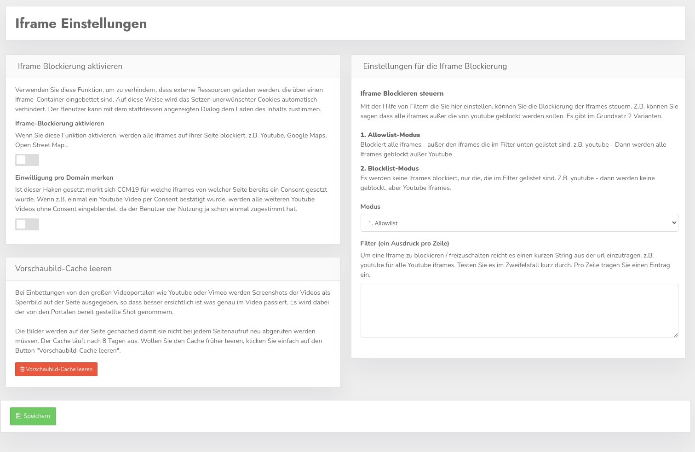
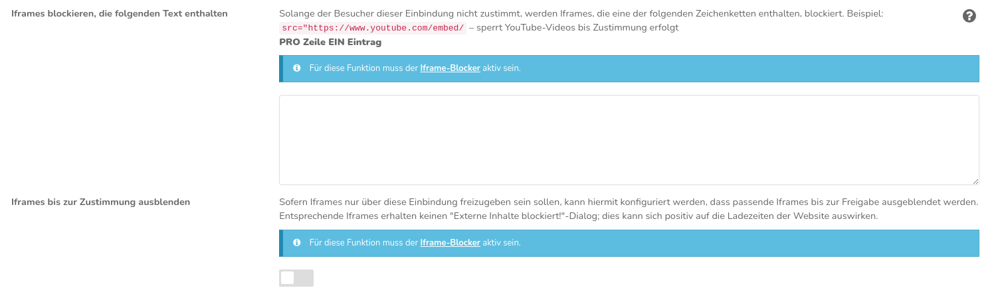

# Iframes blockieren

Verwenden Sie diese Funktion, um zu verhindern, dass externe Ressourcen geladen werden, die über einen Iframe-Container eingebettet sind. Auf diese Weise wird das Setzen unerwünschter Cookies automatisch verhindert. Der Benutzer kann mit dem stattdessen angezeigten Dialog dem Laden des Inhalts zustimmen.

## Iframe-Blockierung aktivieren

Mit dem Haken aktivieren Sie die Blockierung der IFrames - vermutlich offensichtlich...

## Einwilligung pro Domain merken

Ist dieser Haken gesetzt, merkt sich CCM19 für welche iframes von welcher Seite bereits ein Consent gesetzt wurde. Wenn z. B. einmal ein Youtube-Video per Consent bestätigt wurde, werden alle weiteren Youtube-Videos ohne weiteren Consent eingeblendet, da der Benutzer der Nutzung dieser externen Quelle schon einmal zugestimmt hat. 

> Ob das DSGVO-konform ist, kann man derzeit nicht sagen, wir schätzen das derzeit positiv ein, allerdings bleibt die Entscheidung natürlich bei Ihnen.

### Iframe Ausnahmen

Hier gibt es verschiedene Varianten, wenn Sie hier nichts einstellen wird standardmäßig alles immer blockiert.

### Allowlist-Modus

Wenn Sie diese Auswahl treffen, werden alle Iframes blockiert, die nicht auf einen Ausdruck in der Filterliste passen. Tragen Sie dort z.B. youtube ein, wird nur das iframe von Youtube nicht geblockt, wohl aber alle anderen. (Dieses Vorgehen empfehlen wir jedoch gerade für Youtube nicht!) 

### Blocklist-Modus

In dieser Variante werden keine iframes blockiert, es sei denn sie stehen hier in der Liste. Tragen Sie dort nun youtube ein, werden nur die Iframes von Youtube blockiert, nicht aber alle anderen.
Diese Methode ist vor allem dann zu empfehlen, wenn Sie, beispielsweise im Checkout Ihrers Onlineshops, Iframes verwenden, über die Funktionen der Webseite abgebildet werden. Die Auswahl der Zahlungsart läuft in einigen Shopsystemen beispielsweise in einem Iframe ab.

## Filter

Schreiben Sie einen Ausdruck pro Zeile. 

## Vorschaubilder

Bei Einbettungen von den großen Videoportalen wie Youtube oder Vimeo werden Screenshots der Videos als Sperrbild auf der Seite ausgegeben, so dass besser ersichtlich ist was genau im Video passiert. Es wird dabei der von den Portalen bereit gestellte Shot genommem.

Die Bilder werden auf der Seite gechached damit sie nicht bei jedem Seitenaufruf neu abgerufen werden müssen. Der Cache läuft nach 8 Tagen aus. Wollen Sie den Cache früher leeren, klicken Sie einfach auf den Button "Vorschaubild-Cache leeren".

## Verknüpung mit Einbindungen

Damit Iframes auch direkt über das Cookie-Banner freigeschaltet werden können, müssen Sie bei der jeweiligen Einbindung unter "Einbindungen & Cookies" einen passenden Ausdruck im Feld "Iframes blockieren, die folgenden Text enthalten" eintragen.

Wenn dann über das CCM19-Banner beispielsweise der Einbindung "Youtube" zugestimmt wird, würden alle Youtube-Videos auf der Seite bereits freigeschaltet. Wird abgelehnt, würde über jedem Video das blockierende Overlay angezeigt, über das der Iframe nachträglich freigeschaltet werden kann.
