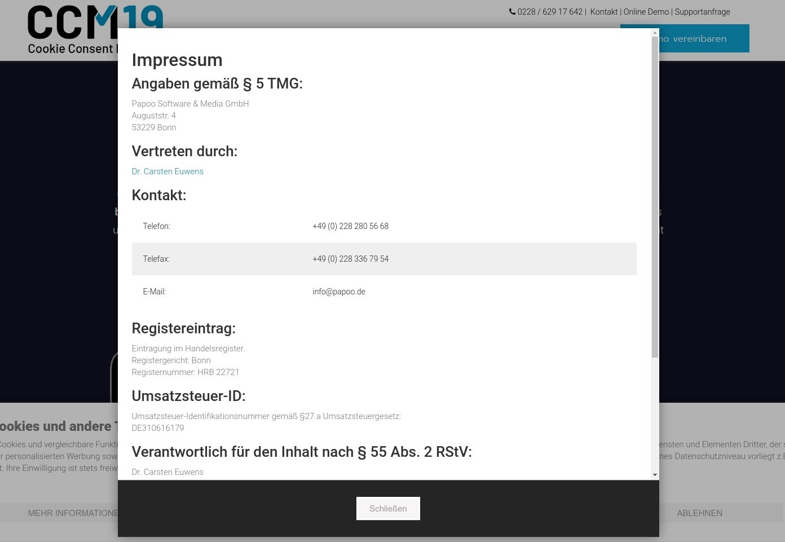

# Impressum

Laut DSGVO muss das Impressum einer Seite - ebenso wie die Datenschutzbestimmungen - noch vor einem Consent vom Benutzer lesbar sein. Der Besucher darf nicht gezwungen werden einen Consent zu machen bevor er diese Daten nicht gesehen hat.

## Impressum als Link

Sie haben die Möglichkeit den Link zum Impressum direkt zu setzen, dazu müssen Sie in der folgenden Maske die Einstellung folgendermaßen setzen: "Impressum verlinken".

Dann können Sie den Link zum Impressum direkt eingeben und er wird auch so im Frontend genutzt.

### Zeige das Widget auf der unten angegebenen Seite an

Wenn Sie dieses Häkchen setzen wird das Widget auch auf der Impressumsseite angezeigt. Dies ist allerdings in den meisten Fällen nicht sinnvoll, da laut DSGVO der Zugang zu der Seite Impressum auch ohne Banner möglich sein muss.

Daher ist der Haken standardmäßig nicht gesezt **und** Sie sollten gut überlegen ob das auch wirklich so genutzt werden soll falls Sie den Haken aktivieren wollen.

### In einem neuen Tab öffnen

Ist der Haken gesetzt öffnen sich die Links in einem neuen Fenster mit target="_blank"

## Impressum bearbeiten

Das Impressum können Sie in der Administration direkt erstellen und bearbeiten, auf dem folgenden Screenshot sehen Sie die Bearbeitungsmaske.

## Impressum im Frontend

Um der DSGVO genüge zu tun bindet CCM19 die Möglichkeit ein das Impressum entweder direkt im Widget erreichbar zu machen, wie auf dem Screenshot zu sehen oder zu verlinken.

Der Link öffnet dann eine Maske wo das Impressum der Seite ausgeben wird - wie hier zu sehen ist.

## Direkte Anzeige des Impressums

