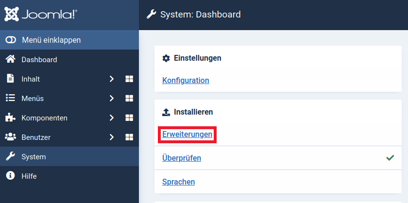
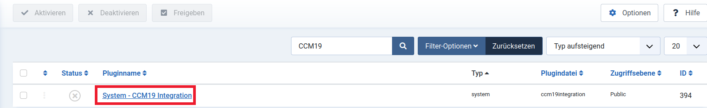
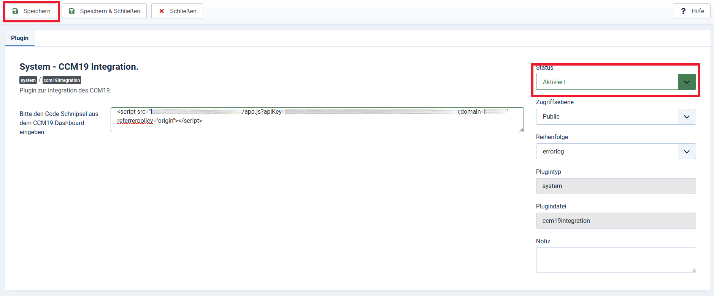

# Joomla

Um den [Cookie Consent Manager](https://www.ccm19.de/integration/glossar/10-Consent.html#10) von Papoo Software & Media GmbH für Ihren Joomla-Blog oder Ihre Joomla-Webseite zu installieren, führen Sie einfach die folgenden Schritte aus:

## Dashboard in CCM19 anwählen

Melden Sie sich bei Ihrem CCM19 Tool an und suchen Sie auf dem Dashboard den Punkt "CCM19 in Ihre Seite einbinden". Dort ist der Code-Schnipsel für Ihre CCM19 Installation hinterlegt.
Diesen werden wir im Schritt *Plugin einrichten* wieder benötigen. 

## Plugin Download

Für die Integration des Cookie Consent Managers in eine Joomla-Webseite, müssen Sie nur ein Plugin hinzufügen. Dieses Plugin finden Sie im Joomla Extension Store oder direkt [hier](https://extensions.joomla.org/extension/site-management/cookie-control/ccm19-integration/).
Drücken Sie dort auf den "Download" Knopf. 

Dieser bringt Sie zu dem aktuellsten Releas des Plugins. Laden Sie diesen als Zip herunter.

## Plugin Installation

Loggen Sie sich nun in Ihre Joomla Administrator Umgebung ein. 
Dort Navigieren Sie dann zu dem System Dashboard. Im System Dasboard klicken Sie im Abschnitt "Installieren" auf "Erweiterungen".

Jetzt klicken Sie auf "Oder eine Datei auswählen" und wählen die zuvor heruntergeladene Zip aus.

## Plugin einrichten

Navigieren Sie im System Dashboard nach "Plugins" im Bereich "Verwalten". Hier suchen Sie dann nach "CCM19" und wählen diesen dann aus.

Fügen Sie nun ihren Code-Schnipsel vom Beginn in das Textfeld ein, setzen Sie den Status auf "Aktiviert" und drücken Sie Speichern. 

## Fertig

Der Cookie Consent Manager sollte nun auf Ihrer Joomla Seite installiert sein. 