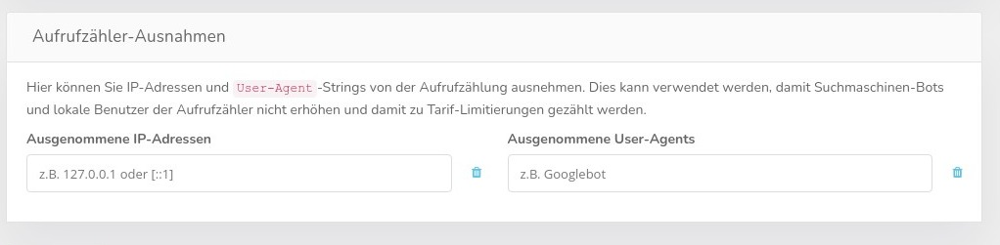

# Netzwerk / Proxy Einstellungen

Diese speziellen Einstellungen kommen nur sehr selten zum Einsatz. CCM19 ist so aufgebaut dass es in der Regel mit den normalen Einstellungen der Provider problemlos zurecht kommt.

## HTTPS-Verbindung erzwingen

Verwenden Sie diese Option, wenn sich die Anwendung hinter einem Load-Balancer oder ähnlicher Umgebung befindet, in der z.B. SSL-Offloading stattfindet. Wenn bestimmte Header nicht weitergeleitet werden, wird eine HTTPS-Verbindung u.U. nicht automatisch erkannt, weshalb Frontend-Ressourcen fälschlicherweise über eine ungesicherte Verbindung angefordert werden können. 

Bei Problemen mit SSL Funktionen ist das also Ihre erste Anlaufstelle.

## Maximale Sitzungs-Inaktivitätszeit

Mit dieser Einstellung können Sie die maximale Wartezeit festlegen, ab der inaktive Backend-Nutzer automatisch abgemeldet werden. Auf `0` setzen für unlimitiert. Die Sitzungslebenszeit kann noch durch andere Faktoren eingeschränkt werden, die nicht unter der Kontrolle von CCM19 stehen.

## Proxy Einstellungen

Verwenden Sie diese Option **nur**, wenn Verbindungen von diesem Server aus durch einen firmeneigenen Proxy geleitet werden müssen. Nutzen Sie `*server*:*port*` oder `http://*server*:*port*` für HTTP-Proxies, `https://*server*:*port*` für HTTPS-, `socks4://*server*:*port*` für SOCKS 4- und `socks5://*server*:*port*` für SOCKS 5-Proxies.

## Aufrufzähler-Ausnahmen

Hier können Sie IP-Adressen und `User-Agent`-Strings von der Aufrufzählung ausnehmen. Dies kann verwendet werden, damit Suchmaschinen-Bots und lokale Benutzer der Aufrufzähler nicht erhöhen und damit zu Tarif-Limitierungen gezählt werden.

Diese Funktion wird in der Cloud Version global für alle User gesetzt.

