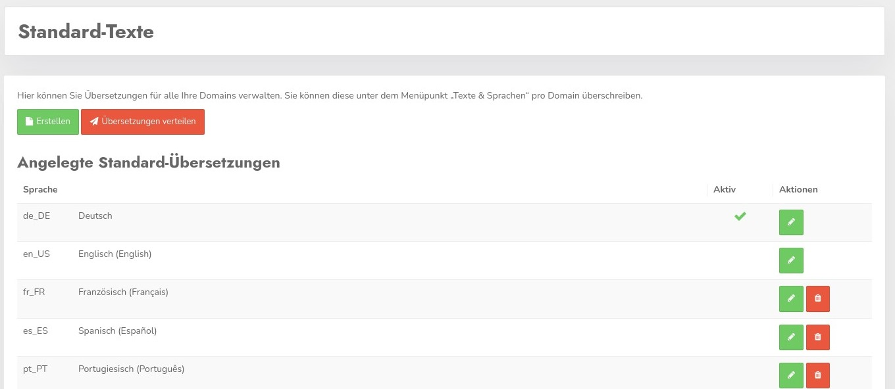
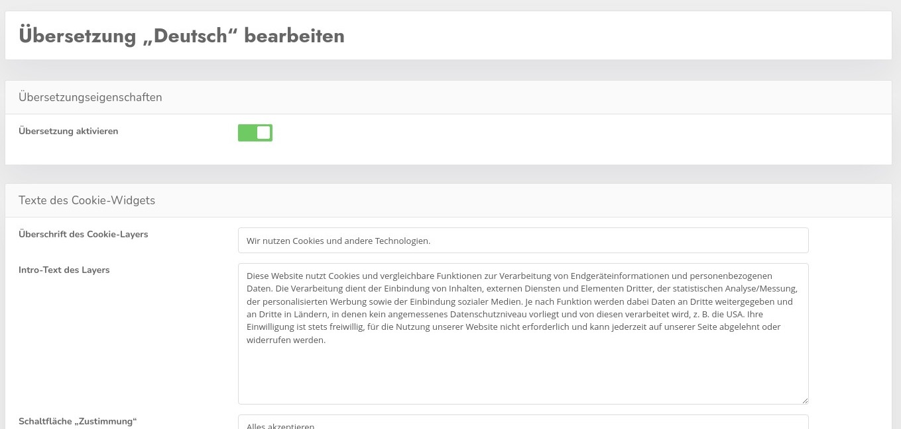

# Standardtexte

DIe domainübergreifenden Standardtexte können Sie hier einstellen. Diese Texte umfassen allen Inhalte die nicht abhängig sind von Cookies oder anderen dynamischen Elemente.

Das ist z.B. der Haupttext auf dem Begrüßungsbanner, oder die Beschriftung der Buttons. Das ganze natürlich immer in allen verfügbaren Sprachen - mind. 24

Mit Erstellen können Sie für eine weitere Sprache Daten erstellen, in der Regel wird man aber die Daten vorhandener Sprachen bearbeiten wollen.

Ähnlich wie bei den Themes können die geänderten Daten auf alle verwendeten Domains auf einen Rutsch ausgespielt werden mit dem Button **Übersetzungen verteilen**. 

Der Klick auf den Stift bringt einen zur Bearbeitungsmaske.

### Einträge bearbeiten

Hier können Sie dann die Einträge entsprechend bearbeiten. Der Haken "Übersetzung aktivieren" aktiviert die Sprache für die Nutzung mit geänderten Texten. WIrd das Häkchen nicht gesetzt, werden weiterhin die Standardtexte dieser Sprache genutzt.

